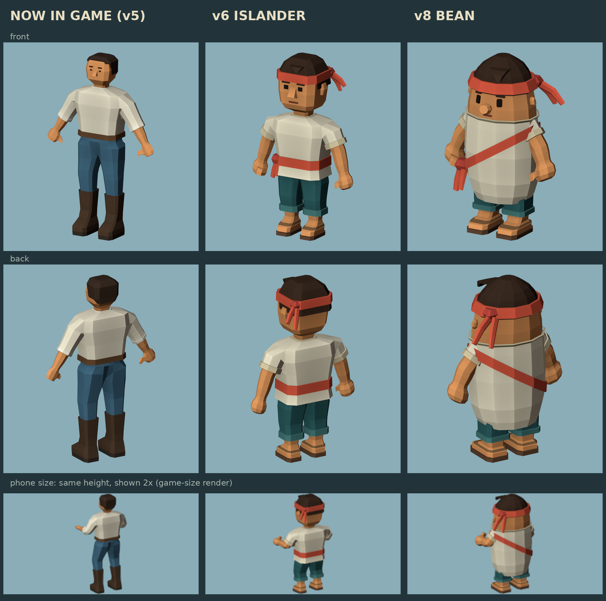

# Bean villager v8 (chosen silhouette D)

The crew/villager model built from silhouette **D, "Bean"**, picked from the studies in
`crew-silhouettes-v7/`. It replaces the deckhand the game uses now
(`Assets/_Project/Art/AstraPlaytest/Crew/Deckhand.fbx`, which is `crew-astra-no-hat-v5`) and
the v6 islander. Like v6, it's a **drop-in replacement**: same skeleton, same mesh
split and same skin-tint contract. **Not imported into Unity**; that's left for the Unity agent.

## Design

- **One bean, no neck.** The cream tunic flows straight into the head; the only line
  between them is a folded collar. This is the most solid, readable shape at phone size.
- **Diagonal coral sash** from the right shoulder to a knot on the left hip, with two tails.
  One diagonal instead of stacked horizontal stripes.
- **Coral headcloth** with two tails flaring out past the head: the silhouette hook.
- **Mitten fists held clear of the body**, with short rolled sleeves and bare, tintable forearms.
- **Short teal shorts**, bare legs, and big sandalled feet for a planted, comic stance.
- **Bold, simple face:** big eyes, brows, a ball nose, a small mouth and ears. They're
  projected onto the curved head so they sit flush.

Palette (sRGB): tunic #E9DFC4, folds #CDBF9C, sash/headcloth #D2553E, knot #B4443A,
shorts #2F5E60, cuffs #437573, hair #3A2A20, sandal #5B4130 / #7C5B3B. Skin #D99259 (set in Unity).

## Runtime contract (same as v5 and v6)

- **Skeleton:** 16 bones with the same names and hierarchy (`root`, `pelvis`, `spine`, `head`,
  and `upper_arm`, `forearm`, `hand`, `thigh`, `shin`, `foot` with `.L` and `.R`).
  `VillagerActing`, `HunterProps` and `AstraPlaytestImport` find bones by these names.
  Rest positions follow the bean proportions.
- **Meshes:** `CREW_Cloth` and `CREW_Skin`, skinned, in rest pose. Rig object `Deckhand_Rig`,
  armature `DeckhandSkeleton`. Same FBX settings as v5 and v6.
- **Skin tint:** skin vertex colours are exported **white**. Keep skin `_BaseColor` at
  sRGB **#D99259** and clothing `_BaseColor` white (`CrewVertexColor` shader). Face,
  forearms, fists, legs and feet all tint green when seasick.
- **Size:** the source is 1.29 m tall. `AstraPlaytestImport` rescales to 1.7 m from the bounds.
- **Budget:** 2,404 triangles (v5 had 1,560, v6 had 2,244). Flat vertex colours, no textures.

## Things to know about the rig

- The **head bone owns the upper bean** (face, hair, headcloth). The body blends from
  `spine` to `head` across the collar, so head nods bend the top of the bean rather than
  turning a separate head on a neck.
- **Shoulders are low and set into the body** (upper arm starts at 0.80 of 1.29 m). The arm
  root sits inside the tunic by design and is hidden by the sleeve.
- **Legs are short:** the thigh is 0.11 and the shin 0.12 source units. The generated walk
  in `AstraPlaytestImport` (thigh swing ±23°) should read as a waddle. Check it in play mode.

## Files

| File | What |
|---|---|
| `deckhand-rigged.fbx` | Runtime FBX, same file name as v5 and v6 |
| `../tools/blender/source/crew-bean-v8.blend` | Editable Blender source, with 5 keyed test poses |
| `../tools/blender/crew_bean_v8.py` | Generator: rebuilds the .blend, FBX, renders and validation |
| `../tools/blender/verify_crew_bean_v8.py` | Independent FBX re-import check |
| `../tools/blender/crew_compare_sheet.py` | Builds `comparison.png` (needs the v5 review renders) |
| `validation.json` | Per-part topology, triangle counts, per-pose clipping checks, palette |
| `export-verification.json` | FBX round-trip result |
| `*-front.png`, `*-rear.png`, `side.png`, `front.png` | Review renders: neutral, working, reach, crouch, stride |
| `game-size.png` | 180x198 crop at gameplay scale |
| `topology-front.png` | Wireframe |

Rebuild: `blender -b -P tools/blender/crew_bean_v8.py`, then
`blender -b -P tools/blender/verify_crew_bean_v8.py`. It also runs with the `bpy` pip module.

## Verification

- Every part: zero overconnected edges, zero degenerate faces, normalized weights.
- Five test poses (neutral, working, reach, crouch, stride): zero degenerate triangles and zero
  triangle intersections for sleeves/arms, shorts/legs, sandals/feet and tunic/head. The generator
  asserts this.
- FBX re-import: 2 meshes, 16 bones with v5's names, 2,404 triangles, vertex colours,
  flat shading, white skin, and rotating `forearm.R` moves the mesh.

**Not yet tested:** Unity lighting and toon shading, the generated walk/idle clips on these
proportions, carry and tool anchor positions (hands are lower and wider apart than v5),
and on-device iPhone readability. Renders are Blender Workbench, not Unity.

## Integration notes for the Unity agent

1. Replace `Assets/_Project/Art/AstraPlaytest/Crew/Deckhand.fbx` with this `deckhand-rigged.fbx`,
   or add it alongside and repoint `AstraPlaytestImport`.
2. Re-run the AstraPlaytest import so the prefab, rescale and generated clips rebuild.
3. Check arm swing against the wide body. The generated arm roll (±24°) moves the fists
   outward, which suits this body, but check that walking arms don't sink into the tunic.
4. Check held tools and carried loads. The fists are big and sit at hip height, wider apart
   than on v5.
