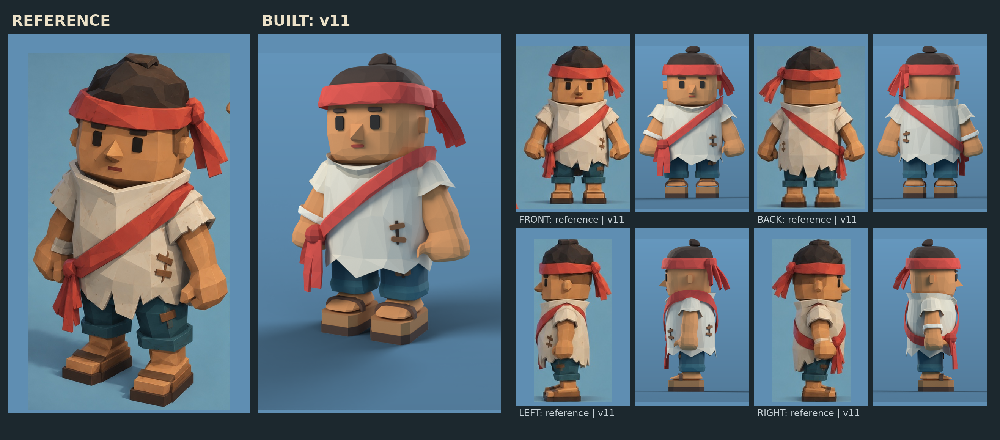

# Islander villager v11: measured rebuild of the reference

The closest reproduction of Kevin's reference sheet (`../crew-islander-v9/reference.jpg`).
Every proportion was measured from the reference's front, back and side views (as a fraction
of total height) and rebuilt at 1.30 m. The surface is a sculpted low-poly: rounded volumes,
smoothed once and decimated into irregular facets, like the painted concept. It's a
**drop-in replacement** for the in-game deckhand (same skeleton, mesh split and skin-tint
contract). **Not imported into Unity**; that's left for the Unity agent.

## Measured proportions (fraction of height, from the reference)

| Feature | Reference | v11 (at 1.30 m) |
|---|---|---|
| Chin to hair top (head) | 0.62 to 0.96 | 0.80 to 1.25 |
| Headband | 0.80 to 0.88, flaring wider than the head | 1.04 to 1.14 |
| Collar top / V bottom | 0.65 / 0.57 | 0.85 / 0.745 |
| Tunic torn hem | 0.21 to 0.27 | 0.27 to 0.35 |
| Shorts / cuff | 0.17 to 0.26 / 0.13 to 0.17 | 0.225 to 0.46 / 0.167 to 0.224 |
| Sandal (sole + wood) | 0 to 0.07 | 0 to 0.094 |
| Fists | 0.28 to 0.36 high, 0.13 wide | 0.36 to 0.47, 0.17 wide |
| Body width / head width | 0.40 / 0.34 | 0.54 / 0.44 |

## Details reproduced

- A rounded-cube head sitting in a thick cowl collar with a V at the front.
- A deep, gently barrelled tunic with long irregular torn teeth, and loose torn sleeves to the elbow.
- Huge forearms and fists in a slight A-pose.
- A diagonal red sash from his left shoulder to a ball knot on his right hip, with three flat tails.
- A flared headband with a ball knot at the back-left of the head and four flat torn tails.
- A hair dome with a tuft on the crown.
- Rectangular eyes, bar brows, a pyramid nose, a small red mouth and block ears.
- Plank-and-stitch patches on the tunic front and back and on the shorts, and a wrap on the right wrist.
- A short baggy band of shorts with a thick rolled cuff just above the ankle.
- Thick two-layer platform sandals with an arched instep strap.

## Honest differences from the reference

- **No painted texture.** The game uses flat vertex colours; each facet gets a faint shade of
  its own instead. Skin is one flat colour because the game tints it green for seasickness.
- The front of the reference's tunic hangs a little longer, with a deeper V. The face is slightly
  broader and the hair messier. These are small, fixable shape tweaks.
- The deep-crouch test uses a **heel-raised squat**. With the reference's low, baggy cuff, a
  flat-footed deep squat (ankle bent to about 67°) forces the cuff into the instep, as real cloth
  would fold. Standing, walking, working and reaching poses use the normal flat foot.
- The `lit-*.png` renders use soft studio lighting (Cycles) to compare against the painted
  concept. In Unity he'll use the game's own lighting.

## Runtime contract

- 16 bones with the same names and hierarchy as v5.
- `CREW_Cloth` and `CREW_Skin`, skinned, in rest pose.
- Skin vertex colours exported white (skin `_BaseColor` #D99259, clothing `_BaseColor` white).
- 1.297 m source height, rescaled to 1.7 m by `AstraPlaytestImport`.
- **4,288 triangles** (v5 had 1,560). Flat vertex colours, no textures. A few villagers on
  screen at once is fine on an iPhone 16 Pro; check the budget if crowds get large.

## Verification

- Five test poses (neutral, working, reach, crouch, stride): zero intersections for sleeves/arms,
  wrist wrap/arm, shorts/legs, sandals/feet and tunic/head. The generator asserts this.
- Weights normalized on every vertex. FBX re-import: 2 meshes, 16 bones with v5's names,
  4,288 triangles, white skin, and the rig moves the mesh.
- **Not yet tested:** Unity lighting, the generated walk and idle clips on these proportions,
  tool and carry anchors (the fists are big and wide), and on-device performance.

## Files

| File | What |
|---|---|
| `deckhand-rigged.fbx` | Runtime FBX |
| `../tools/blender/crew_islander_v11.py` | Generator (the .blend, FBX, preview renders, validation) |
| `../tools/blender/verify_crew_islander_v11.py` | FBX re-import check |
| `../tools/blender/render_v11_lit.py` | Soft-lit Cycles renders (`lit-*.png`) |
| `../tools/blender/crew_v11_sheet.py` | Builds `reference-vs-v11.png` |
| `../tools/blender/source/crew-islander-v11.blend` | Editable source with 5 keyed test poses |
| `validation.json`, `export-verification.json` | Checks |

## Integration notes for the Unity agent

1. Replace `Assets/_Project/Art/AstraPlaytest/Crew/Deckhand.fbx` with `deckhand-rigged.fbx`,
   or add it alongside and repoint `AstraPlaytestImport`.
2. Re-run the AstraPlaytest import so the prefab, rescale and clips rebuild.
3. Check arm swing against the wide tunic, tool and carry anchors, and performance with a
   full camp on screen.
