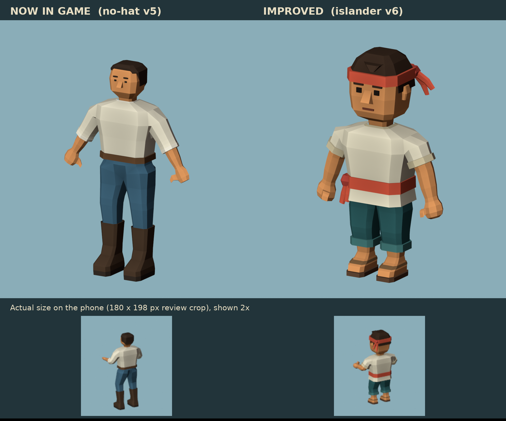

# Islander villager v6 (improves crew-astra-no-hat-v5)

The improved crew/villager model. It's based on the deckhand the game uses now
(`Assets/_Project/Art/AstraPlaytest/Crew/Deckhand.fbx`, which is the same file as
`art-staging/crew-astra-no-hat-v5/deckhand-rigged.fbx` in the `seasick` repo).
It's built as a **drop-in replacement**: same skeleton, same mesh split and same
skin-tint contract. **Not imported into Unity**; that's left for the Unity agent.

## What changed, and why

| # | Change | Reason (GDD / CLAUDE.md) |
|---|---|---|
| 1 | About 3.6 heads tall instead of about 6.5: bigger head, broad barrel torso, short legs, big fists | Crew are about 24 px tall on the phone. Chunky forms read better, and this follows the approved "Option C" proportion study (`docs/art-direction/crew-concept/c/`) |
| 2 | Undyed cream tunic with rolled sleeves, cloth sash, cropped rolled trousers, bare feet in leather sandals | The crew is an island tribe that has never sailed. The T-shirt, jeans and riding boots looked modern. The cream matches the approved patched tarps |
| 3 | One strong accent: coral sash and headcloth (#D2553E), over cream and deep teal (#2F5E60) | The old white, blue and brown were similarly muted. The game palette is timber, cream, teal and vermilion |
| 4 | Silhouette hook: headcloth knot with two flared tails, plus a forelock | Instantly recognisable outline. Hats were dropped in v5, so this uses cloth instead |
| 5 | Chunky fists with a short, tucked thumb | The old mitten hands had a spike thumb. Big fists suit tool holding and carrying |
| 6 | Big eyes, heavy brows, broad nose, a mouth, ears | Bolder but simpler. "Body language over facial animation" |

Also: bare forearms, shins and feet are skin, so more of the body turns green
when seasick (the skin mesh is tinted at runtime).

## Runtime contract (unchanged from v5)

- **Skeleton:** 16 bones with the same names and hierarchy (`root`, `pelvis`, `spine`, `head`,
  and `upper_arm`, `forearm`, `hand`, `thigh`, `shin`, `foot` with `.L` and `.R`). `VillagerActing`,
  `HunterProps` and `AstraPlaytestImport` find bones by these names. Rest positions
  moved to the new proportions; animation is still generated from rest pose.
- **Meshes:** two skinned meshes, `CREW_Cloth` and `CREW_Skin`, in rest pose. Rig object
  `Deckhand_Rig`, armature `DeckhandSkeleton`. Same FBX settings as v5 (-Z forward,
  Y up, triangulated, flat normals, linear vertex colours, no baked animation).
- **Skin tint:** skin vertex colours are exported **white**. Keep skin `_BaseColor` at
  sRGB **#D99259** and clothing `_BaseColor` white (`CrewVertexColor` shader).
- **Size:** the source is 1.66 m in rest pose. `AstraPlaytestImport` rescales to 1.7 m
  from the bounds, as it did for v5.
- **Budget:** 2,244 triangles (v5 had 1,560). Flat vertex colours, no textures.

## Files

| File | What |
|---|---|
| `deckhand-rigged.fbx` | Runtime FBX, same file name as v5 |
| `../tools/blender/source/crew-islander-v6.blend` | Editable Blender source, with 5 keyed test poses |
| `../tools/blender/crew_islander_v6.py` | Generator: rebuilds the .blend, FBX, renders and validation |
| `../tools/blender/verify_crew_islander_v6.py` | Independent FBX re-import check |
| `validation.json` | Per-part topology, triangle counts, per-pose clipping checks, palette |
| `export-verification.json` | FBX round-trip result |
| `*-front.png`, `*-rear.png`, `side.png` | Review renders: neutral, working, reach, crouch, stride |
| `game-size.png` | 180x198 crop at gameplay scale |
| `topology-front.png` | Wireframe |

Rebuild: `blender -b -P tools/blender/crew_islander_v6.py`, then
`blender -b -P tools/blender/verify_crew_islander_v6.py`. It also runs with the `bpy` pip module.

## Verification

- Every part: zero overconnected edges, zero degenerate faces, normalized weights.
  Tunic and trousers are single connected garments; the only openings are hem,
  neck, sleeve cuffs and trouser cuffs.
- Five test poses (neutral, working, reach, crouch, stride): zero degenerate triangles,
  and zero triangle intersections for tunic/arms, trousers/legs and sandals/feet.
- FBX re-import: 2 meshes, 16 bones with v5's names, 2,244 triangles, vertex colours,
  flat shading, white skin, and rotating `forearm.R` moves the mesh.

**Not yet tested:** Unity lighting and toon shading, the generated walk/idle clips on the
new proportions, carry and tool anchor positions, and on-device iPhone readability.
Renders are Blender Workbench, not Unity.

## Integration notes for the Unity agent

1. Replace `Assets/_Project/Art/AstraPlaytest/Crew/Deckhand.fbx` with this
   `deckhand-rigged.fbx`, or add it alongside and repoint `AstraPlaytestImport`.
2. Re-run the AstraPlaytest import so the prefab, rescale and generated clips rebuild.
3. Check the arm swing: arms now hang from shoulders at 1.05 m (source units) and hands
   end at mid-thigh. The generated arm roll (±24°) should clear the wider torso,
   but check it in play mode.
4. Check held tools and carried loads. Hands are larger and sit lower relative to height.
