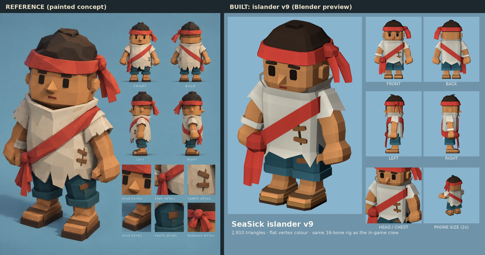

# Islander villager v9 (Bean refined to match Kevin's reference)

`reference.jpg` is a painted concept Kevin got by showing v8 (the Bean) to another tool and
asking for "a more refined look while keeping the style". This is that concept rebuilt as a
game-ready, rigged, flat-vertex-colour model, as close as the game's art pipeline allows.
Like v6 and v8, it's a **drop-in replacement** for the in-game deckhand. **Not imported into
Unity**; that's left for the Unity agent.

## What was reproduced from the reference

- **Blocky, chiselled forms:** a chamfered box head about as wide as the body, a squared
  tunic, block arms, block fists with a thumb, block feet. v8 was a round 12-sided bean.
- **Tall stand-up collar with a V cut** at the front; the head sits down into it.
- **Ragged hems:** an irregular zigzag tunic hem and torn short sleeves.
- **Diagonal red sash** from his left shoulder to a big ball knot on his right hip, with two
  long tails.
- **Wide red headband** with a ball knot and three tails on his left side.
- **Rounded, messy hair dome** above the band, with a small tuft on top.
- **Face:** tall rectangular eyes, heavy brows, a pyramid nose, a small red mouth, block ears.
- **Repairs:** two wooden planks over a stitch on the tunic (his left, low chest), and a patch
  on the left shorts leg.
- **White cloth wrap** on his right wrist.
- **Baggy blue-teal shorts** past the knee with a deep rolled cuff.
- **Two-layer sandals:** a dark sole, a wooden layer and an instep strap.

## What differs from the reference, and why

- **Painted texture and soft lighting.** The game uses flat vertex colours and no textures. The
  painted cloth is suggested by a faint ±4% colour variation per face, on cloth only.
- **Skin is one flat colour.** The game tints the skin mesh green for seasickness, so skin is
  exported white and coloured by the material.
- **Proportions are slightly adjusted** so the shorts cuff clears the ankle in a deep crouch.
  It sits about 2 cm higher than in the painting.
- The previews are Blender Workbench renders, so they're flatter than the painted concept.
  Unity's toon lighting will look different again.

## Runtime contract (same as v5, v6 and v8)

- **Skeleton:** 16 bones with the same names and hierarchy (`root`, `pelvis`, `spine`, `head`,
  and `upper_arm`, `forearm`, `hand`, `thigh`, `shin`, `foot` with `.L` and `.R`).
- **Meshes:** `CREW_Cloth` and `CREW_Skin`, skinned, in rest pose. Rig `Deckhand_Rig`, armature
  `DeckhandSkeleton`. Same FBX settings as before.
- **Skin tint:** skin vertex colours are exported **white**. Skin `_BaseColor` sRGB **#D99259**,
  clothing `_BaseColor` white (`CrewVertexColor`).
- **Size:** 1.295 m source. `AstraPlaytestImport` rescales to 1.7 m.
- **Budget:** 2,910 triangles (v5 had 1,560, v8 had 2,404). Flat colours, no textures.

The collar follows the spine and the head bone moves the head alone. The head sits inside the
collar, so a nod turns the head within it.

## Files

| File | What |
|---|---|
| `deckhand-rigged.fbx` | Runtime FBX |
| `reference.jpg` | The concept this reproduces |
| `turnaround.png`, `reference-vs-v9.png` | Sheet laid out like the reference, and the side-by-side |
| `../tools/blender/source/crew-islander-v9.blend` | Editable Blender source, with 5 keyed test poses |
| `../tools/blender/crew_islander_v9.py` | Generator: rebuilds the .blend, FBX, renders and validation |
| `../tools/blender/verify_crew_islander_v9.py` | Independent FBX re-import check |
| `../tools/blender/crew_v9_sheet.py` | Builds the two sheets |
| `validation.json`, `export-verification.json` | Topology, per-pose clipping checks, palette; FBX round trip |
| `*-front.png`, `*-rear.png`, `front/back/left/right.png`, `closeup.png`, `game-size.png`, `topology-front.png` | Review renders |

## Verification

- Every part: zero overconnected edges, zero degenerate faces, normalized weights.
- Five test poses (neutral, working, reach, crouch, stride): zero intersections for
  sleeves/arms, wrist wrap/arm, shorts/legs, sandals/feet and tunic/head. The generator asserts this.
- FBX re-import: 2 meshes, 16 bones with v5's names, 2,910 triangles, vertex colours, flat
  shading, white skin, and rotating `forearm.R` moves the mesh.

**Not yet tested:** Unity lighting, the generated walk and idle clips, tool and carry anchors
(the fists are big and at hip height), and on-device iPhone readability.

## Integration notes for the Unity agent

1. Replace `Assets/_Project/Art/AstraPlaytest/Crew/Deckhand.fbx` with this `deckhand-rigged.fbx`,
   or add it alongside and repoint `AstraPlaytestImport`.
2. Re-run the AstraPlaytest import so the prefab, rescale and generated clips rebuild.
3. Check arm swing against the square tunic and sleeves, and check held tools and carried loads.
