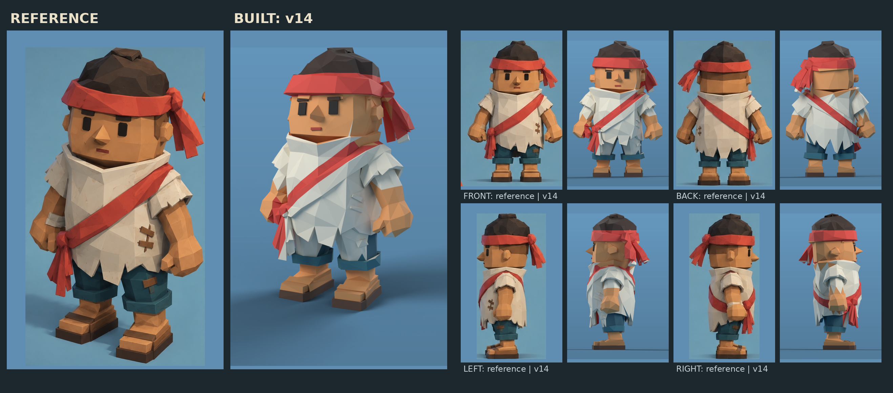

# Meshy character v14: the reference character, game-ready and rigged

Kevin generated the reference character with Meshy (image-to-3D, "Bandana Adventurer").
This folder turns that model into a drop-in replacement for the in-game deckhand
(`Assets/_Project/Art/AstraPlaytest/Crew/Deckhand.fbx`, `crew-astra-no-hat-v5`).
**Not imported into Unity**; that's left for the Unity agent.

## What was done to the Meshy file

| Step | Result |
|---|---|
| Source (`source/meshy-bandana-adventurer.fbx`) | 1 mesh, **771,306 triangles**, no UVs, no texture, no colours, no rig; Z up, facing −Y |
| Normalise | Feet on the ground, 1.30 m tall (`AstraPlaytestImport` rescales to 1.7 m) |
| Reduce | Collapse to 40k, dissolve near-coplanar faces (keeps Meshy's flat facets), collapse to 2,300 |
| Clean colour edges | Mesh sliced along the sash's two edges and the headband's top and bottom (+624 triangles) |
| Rig | The game's 16-bone skeleton, placed on landmarks measured from 1 px = 1 mm silhouettes of this mesh |
| Weights | Blender automatic (heat) weights, then rules: the head owns everything above the collar; fists and forearms follow only arm bones (they hang beside the thighs); the sash knot and tails follow the hips; max 4 bones per vertex; normalised |
| Colour | By region (Meshy gave no texture): sandal sole and wood, skin, teal shorts and cuffs, cream tunic, red sash, headband, knot and tails, dark hair |
| Face | Eyes, brows and mouth as crisp plates laid on the face (Meshy's fine eye outlines don't survive the reduction), 50 triangles |
| Split | `CREW_Skin` (754 triangles, vertex colours white for the tint) and `CREW_Cloth` (2,220 triangles) |

**Total: 2,974 triangles** (in-game v5: 1,560; earlier hand-built v11: 4,288).

## Runtime contract (same as the in-game deckhand)

- 16 bones with the same names and hierarchy (`root`, `pelvis`, `spine`, `head`, and `upper_arm`,
  `forearm`, `hand`, `thigh`, `shin`, `foot` with `.L` and `.R`). Rig object `Deckhand_Rig`,
  armature `DeckhandSkeleton`.
- Skinned meshes `CREW_Cloth` and `CREW_Skin` in rest pose, with vertex-colour materials
  `Crew_Cloth` and `Crew_Skin`.
- Skin vertex colours exported **white**. Set skin `_BaseColor` to sRGB **#D99259** and clothing
  `_BaseColor` to white (`CrewVertexColor`), so the sickness tint works.
- FBX settings as before: −Z forward, Y up, triangulated, flat normals, linear vertex colours,
  no baked animation.

## Verification

- FBX re-import: 2 meshes, 16 bones with v5's names, 2,974 triangles, vertex colours, flat shading,
  white skin, every vertex's weights sum to 1 with at most 4 bones, and the rig moves the mesh.
- Deformation reviewed in five poses (`poses.png`): rest, walk, work, reach and crouch. The
  sleeves stretch a little at full forward reach, which is well beyond the game's generated clips.

**Not yet tested:** Unity lighting, the generated walk and idle clips, tool and carry anchors
(the fists are big and sit at hip height), and on-device performance.

## Known gaps, and the easy fix

- **Colours are by region, not painted:** the wooden patches, stitching and wrist wrap aren't
  coloured, and region edges follow triangles in a few places. **Fix:** in Meshy, run the
  **Texture** step on this model (a few free credits), export again with its texture, and the
  pipeline can bake the real colours onto the facets instead of the region rules.
- Meshy modelled the cowl collar rising high on his right side, so from that side a cream flap
  sits beside the jaw. That's Meshy's geometry, not a colouring error.

## Files

| File | What |
|---|---|
| `deckhand-rigged.fbx` | Runtime FBX |
| `source/meshy-bandana-adventurer.fbx` | Kevin's original Meshy export |
| `../tools/blender/crew_meshy_v14.py` | Pipeline: reduce, cut, rig, weight, colour, face plates, split, export |
| `../tools/blender/verify_crew_meshy_v14.py` | FBX re-import check |
| `../tools/blender/crew_meshy_v14_poses.py`, `crew_meshy_v14_views.py` | Pose and view renders |
| `../tools/blender/render_v14_lit.py`, `crew_v14_sheet.py` | Soft-lit renders and the reference comparison |
| `../tools/blender/source/crew-meshy-v14.blend` | Editable rigged source |

Rebuild: `blender -b -P tools/blender/crew_meshy_v14.py` (or python with the `bpy` module).

## Integration notes for the Unity agent

1. Replace `Assets/_Project/Art/AstraPlaytest/Crew/Deckhand.fbx` with this `deckhand-rigged.fbx`,
   or add it alongside and repoint `AstraPlaytestImport`.
2. Re-run the AstraPlaytest import so the prefab, rescale and generated clips rebuild.
3. Check the arm swing against the wide tunic, tool and carry anchors, and performance with a
   full camp on screen.
