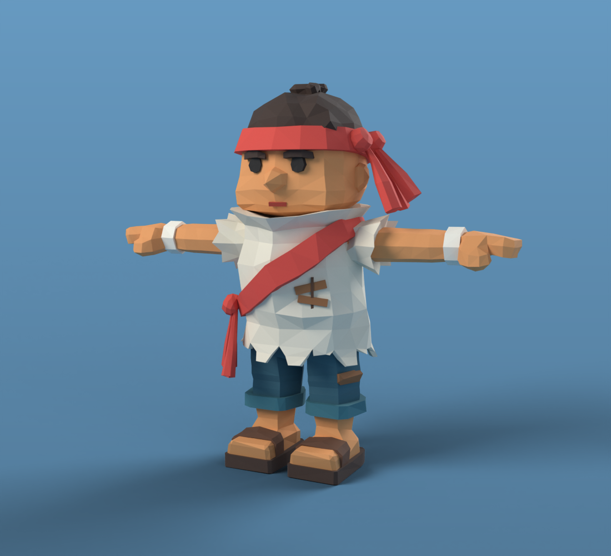
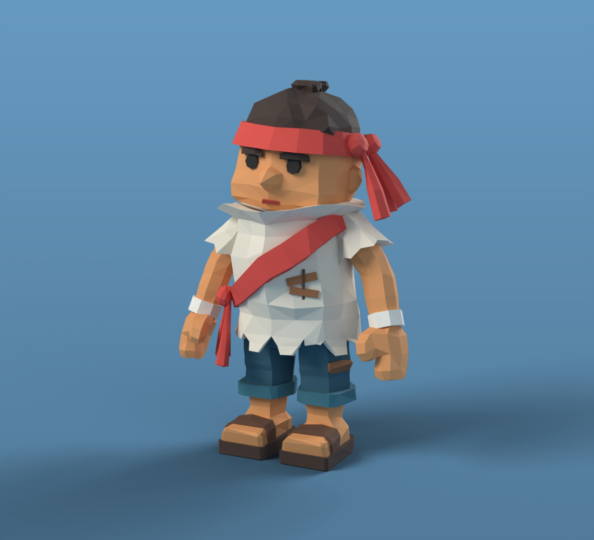
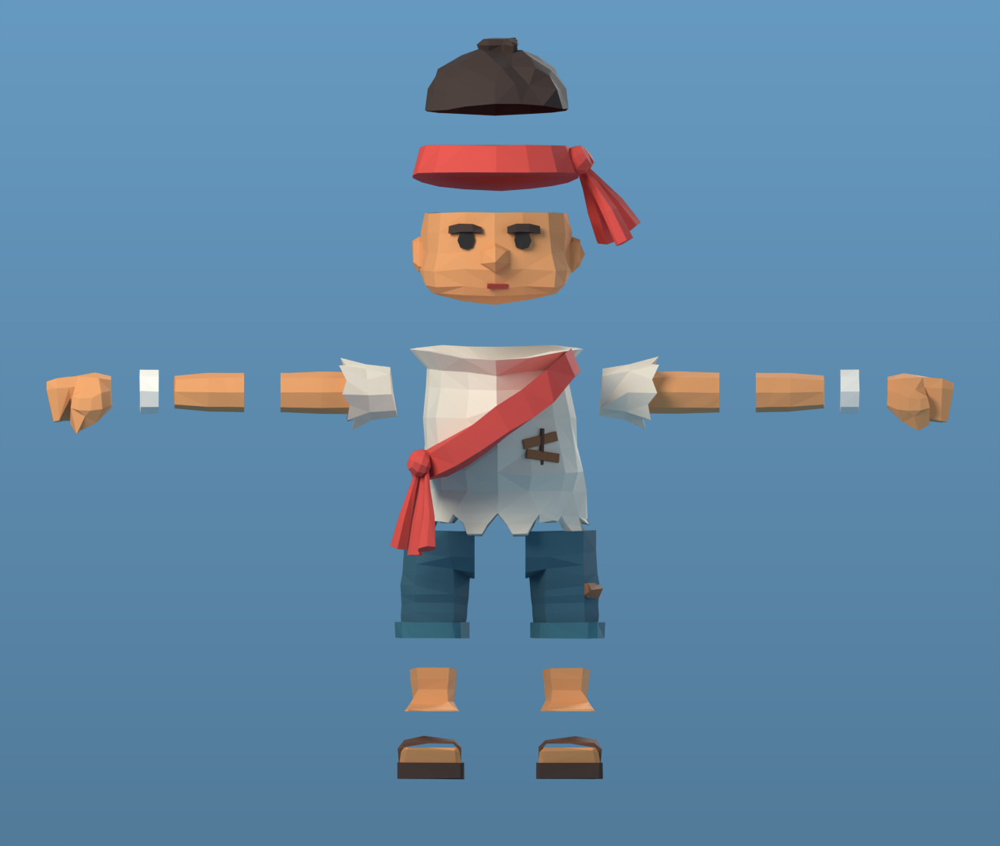

# Meshy character v15: the paid "Red Bandana Adventure" model, coloured

Kevin's paid Meshy generation of the reference character (`../crew-islander-v9/reference.jpg`).
Meshy delivered shape only, but a clean game-ready one, so this folder colours it like the
reference. **Not rigged yet and not imported into Unity**; that's left for the Unity agent.

## The Meshy file

| | |
|---|---|
| Source (`source/meshy-red-bandana-adventure.fbx`) | 1 mesh, **3,095 triangles**, T-pose, no texture, UVs, colours or rig; Z up, facing −Y |
| Pieces | 40 separate parts: tunic, sleeves, sash, sash knot and tails, headband, knot and tails, hair and tuft, head, ears, nose, eyes, brows, arms, hands, wrist wraps, shorts, cuffs, a shorts patch, feet, soles and sandal straps |

## Colouring

Each piece is recognised from its bounding box and gets one flat colour from the reference
(vertex colours, no image textures, like the rest of the game's crew). Cloth faces get a faint
per-face shade; skin stays flat so the game's sickness tint works.

| Colour | Pieces |
|---|---|
| Skin `#D99259` | head, ears, nose, arms, hands, feet |
| Cream linen `#D8CFBC` | tunic, sleeves; wrist wraps a lighter `#E6E0D2` |
| Red `#D0443A` | sash, sash knot and tails, headband, headband knot and tails |
| Dark brown `#3A2921` | hair, tuft, brows |
| Near black `#1C1816` | eyes |
| Teal `#2D5664` / `#2F6572` | shorts / rolled cuffs |
| Sandal | sole `#3E2A20`, wood block `#B07A4A` (bottom of the foot piece), strap `#5A3A28` |
| Patch brown `#8A5A36` | shorts patch |

Added as small plates laid on the surface (Meshy left them out): the mouth `#A23B2F`, and two
planks with a stitch on the tunic's front, as in the reference. **Total: 3,135 triangles**,
1.30 m tall (`AstraPlaytestImport` rescales to 1.7 m).

## Files

| File | What |
|---|---|
| `deckhand-v15-coloured.fbx` | Coloured, unrigged, T-pose (vertex colours, −Z forward, Y up, flat) |
| `lit-*.png` | Soft-lit review renders |
| `validation.json` | Pieces found per colour, triangle count |
| `../tools/blender/crew_meshy_v15_colour.py` | Colouring pipeline |
| `../tools/blender/render_v15_lit.py` | Review renders |
| `../tools/blender/source/crew-meshy-v15.blend` | Editable coloured source |

## Rig and idle pose

`../tools/blender/crew_meshy_v15_pose.py` adds the game's 16-bone deckhand skeleton (same names
and hierarchy as v5 and v14) and poses him like the reference: arms hanging clear of the tunic,
elbows softly bent, head turned a little. Weights come from Meshy's pieces instead of a heat
solve: head pieces follow the head, hands the hands, sleeves the upper arms, the sash knot and
tails the hips. Only the one-piece arms blend across the elbow and wrist, and the tunic's
shoulder frill follows the arm a little.

| File | What |
|---|---|
| `deckhand-v15-rigged.fbx` | Rigged, T-pose rest, skin exported white (same runtime contract as v14) |
| `pose-*.png` | Idle pose renders |
| `../tools/blender/source/crew-meshy-v15-posed.blend` | Rig with the idle pose applied |

**Fists:** Meshy's hands were open mittens (a finger slab as thick as it is long, and a thumb
sticking forward). `close_fists` turns them into the reference's chunky block fists before
rigging: the underside of palm and fingers drops to fist depth, tapering into the wrist, the
bottom-front edge tucks back where the fingers curl under, and the thumb presses flat across
the front. See `pose-fist.png`. The rigged FBX carries the fists too.

Still to do for the game: the `CREW_Skin` / `CREW_Cloth` split, checks against the generated
walk and work clips, and an FBX re-import check.

## Separate parts (for custom versions)

`../tools/blender/crew_meshy_v15_parts.py` splits the rigged character (fists included) into
**21 named objects** on the same 16-bone rig, so custom versions can swap or recolour one part:

| Part | Contains |
|---|---|
| `Head` | head, ears, nose, eyes, brows, mouth |
| `Hair` | hair and top tuft |
| `Headband` | band, knot and tails |
| `Torso` | tunic and its plank patch |
| `Sash` | sash, hip knot and tails |
| `Sleeve`, `UpperArm`, `Forearm`, `WristWrap`, `Hand` (.L/.R) | arm tube cut at the elbow |
| `Shorts` (.L/.R) | shorts cut down the middle, with its cuff (and the patch on .R) |
| `Shin`, `Foot` (.L/.R) | shin cut at the ankle; foot with the sandal's wood block, sole and strap |

Each cut is capped, so every part is closed on its own. Sides use the skeleton's suffixes
(`.R` is +X, as for the bones). Weights come from position, so both sides of a cut carry the
same weights and the joints stay closed when he bends (`parts/pose-*.png` look the same as the
one-mesh version). Every object has a `part` custom property with its name.

| File | What |
|---|---|
| `parts/deckhand-v15-parts.fbx` | 21 parts + rig, T-pose rest, preview vertex colours (sRGB) |
| `parts/exploded-*.png`, `parts/pose-*.png` | Exploded view; idle pose |
| `parts/parts.json` | Triangles per part |
| `../tools/blender/source/crew-meshy-v15-parts.blend` | Editable parts with the idle pose applied |

The caps add about 390 hidden triangles (3,527 in all; the FBX re-import counts 3,524 after
dropping three zero-area caps). FBX re-import: 21 meshes, 16 bones, colours, every vertex's
weights sum to 1, at most 2 bones per vertex, all parented to the rig. For the game build, join
the parts back into `CREW_Skin` / `CREW_Cloth`, or use the one-mesh `deckhand-v15-rigged.fbx`.

