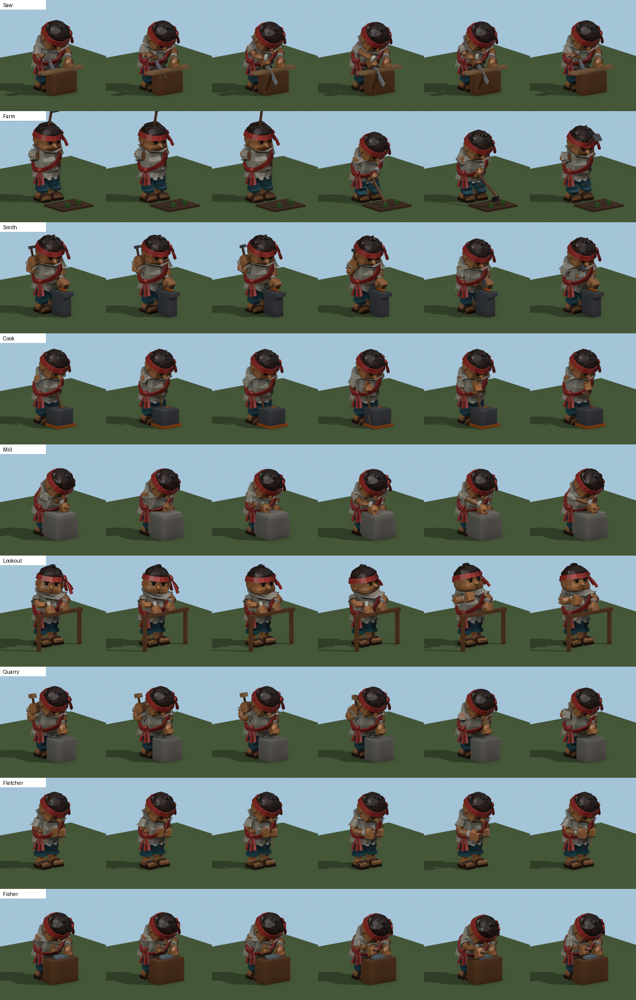
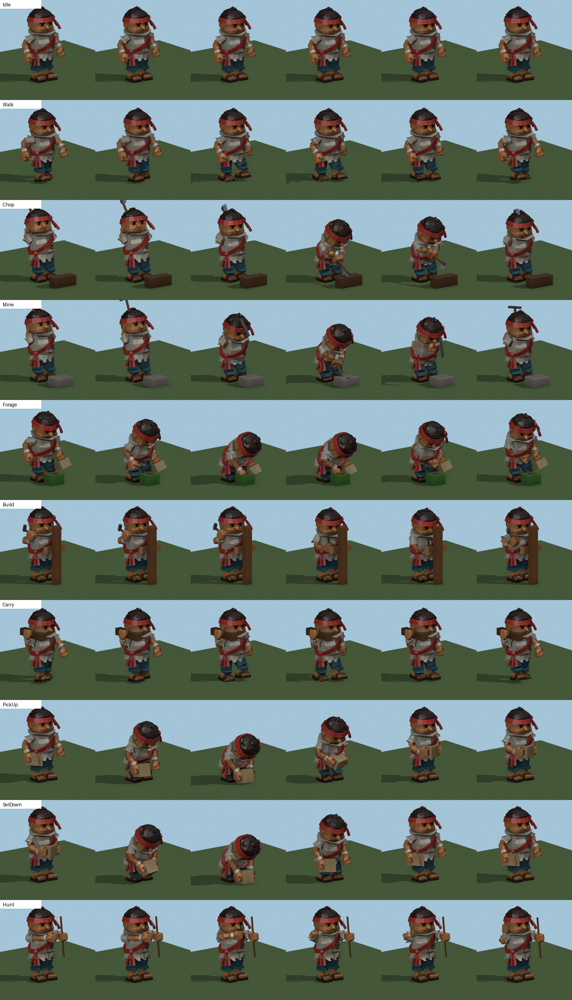
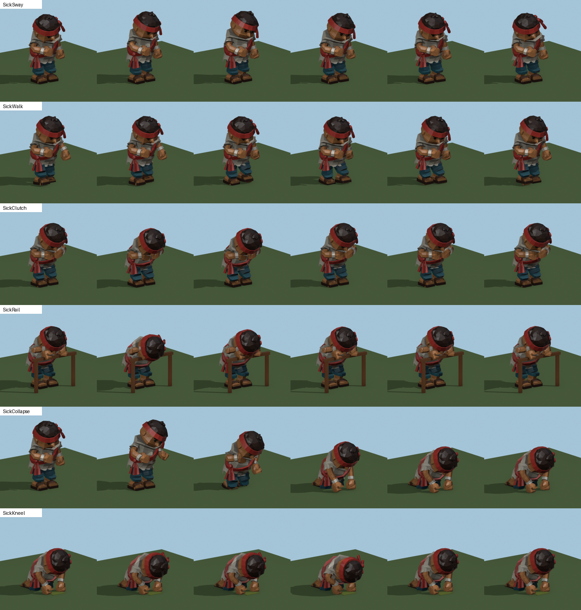
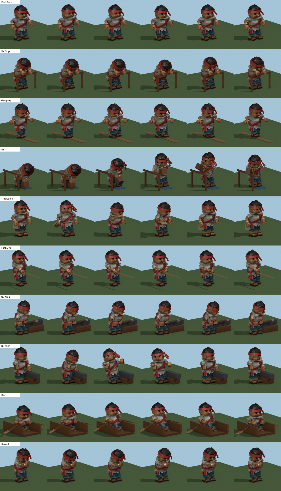

# Task, ship and seasickness animations (v15 deckhand)

One animation per building job and per camp task, on the game's 16-bone deckhand skeleton,
made with `../../tools/blender/crew_meshy_v15_anims.py`. **Not wired into Unity**; that's
for the Unity agent (notes below).

Each clip also has an animated preview, `<Clip>.gif`, and a six-frame strip, `<Clip>-strip.png`.

## Viewer

`../viewer/index.html` plays every clip in 3D in a browser: pick a clip, play, pause, step frames,
scrub, change speed, turn and zoom, and show or hide the clip's tools and props. The model is
embedded, so the one file opens on its own. Rebuild it with
`../../tools/blender/export_v15_viewer.py` after changing the clips.

## Clips

| Take | Building / task | Length | Right hand | Left hand | What he does |
|---|---|---|---|---|---|
| `Crew_Idle` | standing | 2.4 s | - | - | breathing, weight settling, a glance round |
| `Crew_Walk` | walking | 0.9 s | - | - | in place: the game moves him; stride about 0.44 m a cycle |
| `Crew_Chop` | timber, clearing | 1.3 s | axe | - | one-handed flat swing like a bat, from his right into the trunk's side |
| `Crew_Mine` | stone, ore | 1.1 s | pick | - | one-handed vertical pickaxe swing, overhand like a bat, into the rock |
| `Crew_Forage` | spice, food | 1.7 s | - | basket | crouch, pick from a bush, drop it in the basket (spice, food) |
| `Crew_Build` | raising a building | 0.95 s | hammer | - | nailing a board to a post (raising any building) |
| `Crew_Carry` | hauling | 1.2 s | any load on the spine socket (crate shown) | same load | a heavy load held out on both arms, leaning back against it, walking slow and short (in place) |
| `Crew_PickUp` | lifting a load | 2.0 s, one-shot | any load (picked up) | - | squats, takes the load by its sides, heaves it up onto his arms; from Walk, into Carry |
| `Crew_Saw` | Sawmill (sawyer) | 0.9 s | saw | - | sawmill: sawing a plank on a trestle |
| `Crew_Farm` | Farm plot (farmhand) | 1.5 s | hoe | - | hoeing a raised bed of Astra's farm: chops the blade into the soil and drags it back (both hands) |
| `Crew_Smith` | Forge (smith) | 0.8 s | hammer | - | forge: hammering hot iron on the anvil |
| `Crew_Cook` | Kitchen (cook) | 1.6 s | paddle | - | kitchen: stirring the pot |
| `Crew_Mill` | Mill (miller) | 1.5 s | peg | - | mill: turning the quern stone by its peg |
| `Crew_Lookout` | Watchtower (lookout) | 4.0 s | - | - | watchtower: leaning on the rail, scanning the horizon, pointing out a sail |
| `Crew_Quarry` | Quarry (quarryman) | 0.95 s | mallet | chisel | quarry: mallet and chisel, dressing stone into brick |
| `Crew_Fletcher` | Fletcher's (fletcher) | 1.5 s | knife | shaft | fletcher: whittling an arrow shaft |
| `Crew_Fisher` | Fishing hut (fisher) | 1.2 s | knife | - | fishing hut: gutting the catch on the prep bench |
| `Crew_HuntWalk` | hunting, stalking | 2.2 s | spear | - | stalking with the spear raised, crouched and alert, head scanning (in place) |
| `Crew_Hunt` | hunting, the throw | 2.6 s, one-shot | spear (thrown) | - | lines up the goat and throws the spear; from HuntWalk, into Walk |
| `Crew_SetDown` | dropping a load | 2.4 s, one-shot | any load (dropped) | - | drops the load, slumps, wipes his brow, flicks the sweat off; from Carry, into Walk |
| `Crew_SickSway` | seasick, standing | 3.0 s | - | - | queasy: swaying, a fist on his stomach, head lolling |
| `Crew_SickWalk` | seasick, moving | 1.2 s | - | - | queasy walk: short lurching steps, a fist on his stomach (in place) |
| `Crew_SickClutch` | badly seasick | 1.6 s | - | - | hunched over, both fists on his stomach, a cramp each cycle |
| `Crew_SickRail` | seasick at the rail | 1.5 s | - | - | leaning over the rail, heaving twice |
| `Crew_SickCollapse` | worst seasickness | 1.8 s, one-shot | - | - | staggers, knees buckle, down on hands and knees; then `Crew_SickKneel` |
| `Crew_SickKneel` | worst seasickness | 2.0 s | - | - | on hands and knees, heaving |
| `Crew_DeckBrace` | aboard, at his post (`Station`) | 4.0 s | - | - | braced wide, riding the roll of the deck |
| `Crew_RailGrip` | aboard, at the rail through a warning (`RailHold`) | 1.8 s | - | - | gripping the rail while a sea slams him |
| `Crew_Gangway` | boarding (`Boarding`, the gangway) | 2.0 s | - | - | balancing along the plank, arms out (in place) |
| `Crew_Bail` | sent to the buckets (`Bailing`) | 1.6 s | bucket | on the bucket | scooping bilge water and tossing it over the side (rail on his right) |
| `Crew_ThrowLine` | man overboard, rescue (`HaulGoing`) | 1.4 s, one-shot | coiled line | - | throwing the line; then `Crew_HaulLine` |
| `Crew_HaulLine` | man overboard, rescue (`Hauling`) | 1.2 s | - | - | hauling the swimmer in, hand over hand |
| `Crew_GunRam` | gunner: reloading | 3.2 s | - | - | behind the gun: sights along the barrel and lays it with the elevation wedge, from his station beside it (Astra's cannon) |
| `Crew_GunFire` | gunner: firing | 2.0 s, one-shot | linstock | - | from his station touches the linstock to the vent; the gun fires and recoils past him; he flinches and watches the shot |
| `Crew_Row` | jolly boat (`JollyBoatDuty`) | 1.7 s | oar | oar | seated, rowing: reach, pull, feather, return |
| `Crew_Soaked` | resting after a rescue (`restLeft`) | 1.0 s | - | - | arms wrapped round himself, shivering |

All clips are 30 fps (the scene is set to 30 fps before export, and the verifier checks every take's length in seconds), and every loop's last frame matches its first. Walk and Carry are in place
(the game moves him); the stride is about 0.44 m a cycle at this 1.30 m source size.

## How they are made

Each clip is a few key poses of **targets** (where each fist is and which way its tool points,
where the feet stand, how far the hips drop and the spine bends). Every frame is solved from
them (two-bone IK for arms and legs) and baked, so the fists stay on their tools, two-handed
tools stay in both hands, and the feet stay planted. To change a clip, edit its keys in the
script and rerun it, then `render_v15_anims.py` for the previews.

The tools follow the game's tool frame (`VillagerActing.BuildTool`: origin in the middle of the
fist, +Y up the haft, +Z the working side) and its sizes, and they go in his **right hand, the
bone named `hand.L`**, as `VillagerActing.ToolArm` expects. The props and tools in the previews
(log, anvil, pot, quern, rail, bow...) are **preview only**; the FBX carries the rig, mesh and
clips.

## Files

| File | What |
|---|---|
| `deckhand-v15-anims.fbx` | Rig + `CREW_Skin` / `CREW_Cloth` (skin exported white) + all 36 clips as separate takes |
| `clips.json` | Takes, lengths, loop flags, which tool goes in which hand |
| `<Clip>.gif`, `<Clip>-strip.png`, `overview-*.png` | Previews (overview sheets: building jobs, basics and tasks, seasickness, aboard ship) |
| `../../tools/blender/crew_meshy_v15_anims.py` | Clip definitions, IK solver, bake and export |
| `../../tools/blender/render_v15_anims.py` | Preview renders |
| `../../tools/blender/source/crew-meshy-v15-anims.blend` | Editable source with every action |

FBX re-import check (`verify_crew_meshy_v15.py`): 16 bones, `CREW_Skin` + `CREW_Cloth` (3,135 triangles), every take moving. Blender's
importer names the takes `Deckhand_Rig|Crew_<Clip>`, and Unity may show a similar prefix.

## Notes for the Unity agent

- The game currently plays only Idle and Walk and bends bones in code for the work poses
  (`VillagerActing`, modes Chop, Saw, Hammer, Hoe, Stir, Carry, Bend). Wiring these clips means
  adding states to the crew Animator (or playing them directly) and switching them off in
  `VillagerActing` for the jobs that have a clip. `CampWorker.ModeAt` and `ModeFor` already
  map each building position and resource to a job.
- Suggested mapping:
  - sawyer → Saw, farmhand → Farm, smith → Smith, cook → Cook, miller → Mill, lookout → Lookout,
    quarryman → Quarry, fletcher → Fletcher, fisher → Fisher
  - timber and clearing → Chop, stone and ore → Mine, spice and food → Forage
  - raising a building → Build, hauling → Carry, the bend at a pile → PickUp / SetDown,
    hunting → Hunt
- **Saw is the level 1 lumber mill's clip** (`CLIPS['Saw']['env']='mill'`): authored at the
  mill's `Worker_Stand`, sawing the log on the bench. It needs the **lowered bench**
  (`env/lumber-mill-state-kit-lowbench.fbx`, made by `../../tools/blender/mill_l1_lowbench.py`;
  bench top 1.33 m -> 0.78 m, mallet and wedge removed, `Mallet_Tool` kept as an empty for
  `MillL1Import`; `env/bench-height.png`). He stands 10 cm behind `Worker_Stand` (baked into the
  root) so his belly clears the log. The saw's blade runs out of the fist along the forearm
  (tool frame +Z), so the game's saw mesh (blade up +Y) needs turning +90 degrees about X (blade +Y to +Z, teeth to -Y).
- **Chop is set at a tree** (`CLIPS['Chop']['env']='tree'`: Astra's `Tree_B1` at its smallest game
  size, 9 m, the trunk 1.1 m (game) in front of him as `CampWorker.Stand` places a chopper). It is
  **one-handed and swung flat like a bat**: the axe cocked up in front of his right shoulder with
  the body wound 35 degrees right; the fist drops to chest height with the head trailing level
  behind him; the body unwinds and the axe sweeps round level into the trunk's right flank (145
  degrees round from his left), the edge travelling straight at the trunk's centre and biting 2 cm
  into the bark at his chest; he tugs it free and it goes back up the way it came. The haft stays
  clear of the trunk on every frame. With his short arms and round
  belly, every two-handed side swing put one arm through his body at contact. The axe is in his
  right hand at the end of the haft, the game's own grip; the game's two-handed second-hand
  placement (`VillagerActing`, 0.11 m up the haft) is not used by this clip. Chest height is lower
  than the tree's own `Trunk_Target` (1.3 m at game size, above his shoulders).
- **Carry holds any load out on both arms** and looks heavy: arms straight ahead at shoulder
  width, the load resting on both fists with its back against his belly, the body leaning back 16
  degrees with the hips pushed forward under it, head tipped forward half as far to see past it; a
  slow, short, sinking walk (1.2 s a cycle, stride about 0.3 m, measured as Walk's 0.44 m) with a
  waddle from foot to foot. **The carry socket:** the hands are keyed in the spine's frame, so the
  load rides with the spine bone and the fists stay 1 mm under it on every frame. To place any
  asset (the game's stacks of logs, planks, stones, bricks or sacks): put the load's **bottom
  centre** at the socket and move it with the **`spine`** bone. Do it the way `HunterProps` places
  the spear: read the spine's world pose every frame and set the load from it, **not** by
  parenting (the deckhand's bones carry a ~92x scale, and a child of a bone blows up). The socket
  is a fixed offset in the spine's rest frame. At the 1.7 m game size, in the rest pose, it is **(0, 0.847, 0.523) m** in the model's space
  (Unity: x across, y up, z forward), which is (0, -0.40, 0.648) at the 1.30 m source (Blender,
  -Y forward), `CARRY_SOCKET` in the script. Loads up to **0.34 m deep** (front to back, centred on
  the socket) clear his belly; width is free; up to about 0.24 m tall keeps his face clear. The
  checker tests a load both ways (the load in him, and any part of him inside the load). This
  replaces the shoulder carry and `VillagerActing`'s code-bent `Carry` arms: the clip owns the
  arms and the legs.
- **PickUp lifts the load into Carry** and is built to chain **Walk → PickUp → Carry**: its first
  frame is Walk's first frame and its last frame is Carry's first frame, bone for bone, with the
  load exactly on the carry socket (checked: zero difference). He steps in over the load, squats
  and bends, takes it by both sides (fists 4 and 13 mm off its sides), braces with his eyes up,
  heaves it up with his legs holding it out clear of his belly, seats it against his belly at carry
  height, drops his fists below it and slides them in underneath. One-shot, 2.0 s, 61 frames.
  **For the game:** the load sits on the ground with its bottom centre **0.63 m in front of him**
  (game size) until **frame 26** (the grip), then moves with his hands; from **frame 45** it rides
  the carry socket, as in Carry. The side grip is made for a load about **0.65 m wide** (game;
  the preview crate is 0.50 m at his 1.30 m scale): narrower loads leave a gap at the hands,
  wider ones go into them. `clips.json` has the numbers (`load_pickup`); the viewer plays the
  same track.
- **SetDown drops the load** and is built to chain **Carry → SetDown → Walk**: its first frame is
  Carry's first frame and its last frame is Walk's first frame, bone for bone (checked: zero
  difference). He lets go (the fists spring apart and drop), the load falls in front of him, he
  slumps with relief, wipes his brow with the back of his right wrist (head tipped into the hand:
  his arms are too short to reach the middle of that big forehead), flicks the sweat off and steps
  into the walk. One-shot, 2.4 s, 73 frames. **For the game:** the load stays on the spine socket
  until **frame 3** (release), then falls under gravity and **lands on frame 16**, its bottom centre
  at **(0, 0, 0.68) m** from his root (game size: on the ground, 0.68 m in front), turned 4 degrees,
  level. Detach it at frame 3 and tween it there (or drop it with physics) — `clips.json` has the
  numbers (`load_drop`), and the viewer plays the same baked fall. Nothing of him is inside the
  load at any frame, and it lands clear of his toes.
- **Hunting with a spear: HuntWalk, then Hunt** (the spear is the game's own placeholder from
  `HunterProps`, 1.8 m, grip 0.65 m from the butt; tool frame: grip at the fist centre, +Y to the
  point). **HuntWalk** (2.2 s loop, two strides, in place) is a stalk: crouched, leaning in,
  short careful steps that lift and place each foot, the spear raised by his right cheek in a
  javelin grip pointing level ahead (6 degrees up), the left fist out front for balance, the head
  scanning left and right once a loop. Its stride is about 0.34 m a cycle (Walk's 0.44 m).
  **Hunt** (2.6 s, one-shot) starts on HuntWalk's first frame and ends on Walk's first frame
  (checked: zero difference): he turns side-on, points his left arm at the beast and draws the
  spear back level behind his right shoulder, holds the aim, then hips, elbow and arm whip
  through and the spear leaves at 14 degrees up; it flies a real arc (gravity at his scale,
  peaking about 1.6 m up) and sticks; he follows through onto his front foot, back heel up, and
  watches. **For the game:** the hunter now throws instead of jabbing, from **4 m** (game) off the
  beast (`CampWorker.HuntReach` is 1.2 m today). The spear leaves the hand on **frame 35** and
  its point strikes on **frame 48**, at **(0, 0.39, 3.91) m** from his root (straight ahead, at a
  goat's flank height) — `clips.json` (`spear_throw`) has the numbers; the flight in between is
  the viewer's baked track, or any arc between those two points. The preview goat is a stand-in.
- **Manning the cannon: GunRam and GunFire** at Astra's naval deck cannon (`art-staging/cannon-astra-v1`,
  copied to `env/cannon.fbx`), set up for the ship's deck, where the muzzle sits out over the rail.
  One gunner, his **station beside the back of the gun, the gun on his right**, facing outboard like
  the gun, outside the rear wheel and clear of the recoil. **The station, in game metres from the
  gun's origin:** 0.98 m to the gun's side, 1.05 m inboard (so the vent, 0.45 m inboard of the
  origin and 1.21 m up, is 0.6 m ahead of him and 1 m to his right). The barrel is laid at
  **4 degrees** (the model's default; the game fires at 9). The gun stays run out in both clips.
  **GunRam** (3.2 s loop, `Cannon.reloadTime`) is the reload: from the station he steps in behind
  the breech, crouches with his hands on his knees to sight along the barrel, works the elevation
  wedge's handle with his right fist (two pushes) to lay the gun, sights again and steps back to
  the station. Loading the ball is implied: from the back he cannot reach the muzzle, and his
  short arms cannot reach up to prime the vent. **GunFire** (2.0 s, one-shot, linstock in his
  right hand) starts and ends on GunRam's first frame (so ram → fire → ram chains): from the
  station he leans in and **touches the linstock's match to the vent (frames 23-24); the gun fires
  on frame 24 and recoils 0.55 m by frame 26** (`Cannon.recoilDistance`) past his right side; he
  flinches away, watches the shot and settles back as **the gun runs out again (frames 33-54)**.
  `clips.json` (`cannon`) has the numbers. Poses were found by search against the anatomy checker
  with the gun's parts as props, tested on their real surfaces (not their boxes).
  **For the game:** `CannonBattery` stands the gunner 0.72 m *inboard* of the gun today, which is
  inside this gun's breech and in its recoil path; with this kit he belongs at the station above,
  1.05 m inboard and 0.98 m to the side. The linstock is a new tool the game doesn't have yet.
- **Farm is set at Astra's level 1 farm** (`CLIPS['Farm']['env']='farm'`: `art-staging/farm-astra-lvl1-v1`,
  `farm-state-kit`, copied to `env/farm.fbx`). He works the front row's centre bed (`Bed_02`), shown
  bare (turned soil); the others show sprouts, the growing and ripe crops and the harvest sheaves
  are hidden. The bed's front edge is 0.55 m (game) ahead of him. Two-handed hoe, 1.5 s loop
  (`VillagerActing.Hoe_Period`): his short arms can't hold a haft square in front of his belly
  without the forearms sinking into it, so he stands as a hoer does, **turned 35 degrees to his
  right with the haft across him**, the right fist at his hip and the left hand far down the haft
  (it slides a little as he works). From the raised hoe (blade at chest height) he chops the blade
  into the soil (frame 14, 2 cm deep, 0.88 m ahead of him in game metres), holds, drags it 13 cm back
  towards him through the soil (to frame 32) and lifts it again. The blade stays inside the bed's
  edging. The game plays the hoe for both planting and harvesting a plot (`PlantSeconds` /
  `HarvestSeconds`, 4 s each), so the loop runs a little under three strokes per plot.
- **Mine is set at a rock** (`CLIPS['Mine']['env']='rock'`: Astra's `Stone_Field`, the commonest
  deposit, from `art-staging/stone-resources-astra-v2`, copied to `env/Stone_Field.fbx`). He stands
  where `StoneDeposit.StandOff` puts a miner: its footprint radius plus 0.7 m, 1.80 m (game) from
  the rock's pivot, so its front face is about 1 m off. The rock's front and `__Mine_Target` are
  turned to him (in the game its yaw is random). Its top (1.11 m) is above his shoulders, so the
  swing is **one-handed and vertical, overhand like a bat**: the pick raised behind his head, the
  fist coming up to head height with the pick's head trailing above, the arm reaching forward as
  the pick tips over, and the point driving 60 degrees down into the rock's sloping upper front
  (0.63 m game), in line with his right shoulder. It holds, levers free and goes back up the way
  it came. The pick clears the rock on every frame but for its point. The pick is still the
  game's fallback box pick: the game has no pickaxe model yet.
- Tools in the previews are **Astra's worker tools v1** (`env/tools/`, from
  `art-staging/worker-tools-v1`), placed by the game's tool frame.
- New tools the game doesn't have yet: pickaxe, mallet and chisel, quern peg, knife, arrow
  shaft, bow, basket, bucket, coiled line, rammer, linstock, oars (the clips work without them; they only show in the previews).
- Walk, Carry and SickWalk need their playback speed matched to the move speed (Carry's stride is shorter: about 0.3 m a cycle against Walk's 0.44 m).
- Aboard: `CrewAgent`'s states map straight onto the ship clips (Station -> DeckBrace,
  RailHold -> RailGrip, Bailing -> Bail, AtRail -> SickRail, HaulGoing/Hauling -> ThrowLine then
  HaulLine, JollyBoatDuty -> Row, the post-rescue rest -> Soaked); gunners play GunRam while
  reloading and GunFire on the shot.
- Seasickness: `CrewAgent.Sickness01` could pick SickSway / SickWalk from about 0.4, SickClutch
  from about 0.7 and SickCollapse then SickKneel near 1; SickRail when a sick hand is sent to the
  rail. The vomit itself (a splash or particles) is for the game to add; the preview puddle is
  a prop.
- **Not yet tested in Unity:** the clips on the imported rig, tool placement on the real tool
  meshes, and blending between clips.
