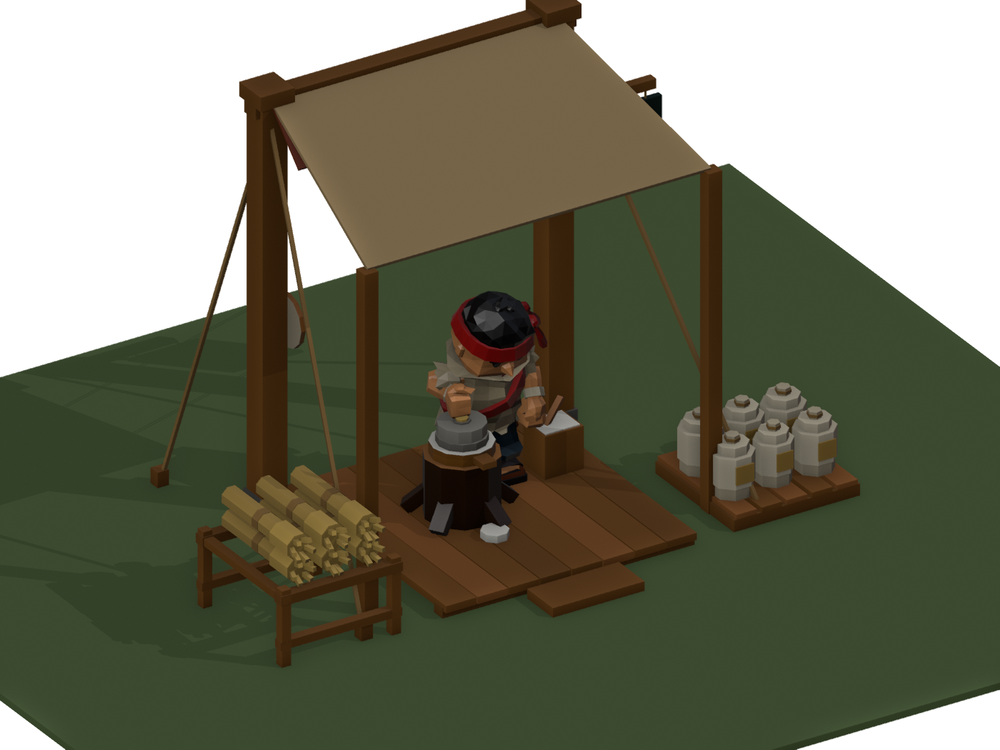

# Mill level 1 concept: a quern under a canvas

Concept for review, not a game kit. Built by `tools/blender/mill_l1_concept.py`.
Kevin, 2026-10-02: *"now make the lvl 1 mill"*.

## What it is in the game

`BuildPlan.Mill` (fire II, food rework): a miller grinds 2 wheat into 1 flour, with 6 input and 6 output
slots, on a 5.2 × 4.8 m plot with a 3.6 m ridge. Until now it wore the sawmill model as placeholder art.
It's a first-tier building, so by the art direction it gets a canvas roof. Like the level 1 sawmill, the
input is on the left, the work in the middle and the output on the right, with both stores forward of the
canopy.

## The design

- **The quern:** a tall hand quern on a tree stump. A wooden tray catches the flour, the bed stone sits in
  the tray, the runner stone turns on it with its peg, and a spout drops flour onto a small heap
  (`Flour_Heap`, shown while grinding).
- **The canopy:** canvas on two back posts with a ridge pole and guy ropes, down to two front poles, a
  near-flat awning, so the game camera sees the miller under it. The red stripe is on its back edge.
- **Input:** `Input_Sheaf_01..06`, wheat sheaves (bundled stalks, a hemp band, splayed ears) on a low rack
  under `Input_Container`.
- **Output:** `Output_Sack_01..06`, flour sacks (plump linen, gathered neck, a wheat mark) on a pallet under
  `Output_Container`.
- **Dressing:** a sieve on the back post, a flour bin with a scoop, and a trade sign (an ear of wheat and a
  millstone) on the right post.
- **Markers:** `Worker_Stand` (0.2, 0.62, 0.12), `Worker_Approach`, `Input_Pickup`, `Output_Dropoff`,
  `Entrance_Anchor`, `Quern_Anchor` (the runner's axis on the bed stone). Root `Mill_Level_1`, Blender
  coordinates, front −Y. 2,880 triangles. The script checks the plot and the ridge.

## The miller (`Crew_Mill`, reworked)

The old `Crew_Mill` clip turned a knee-high quern, and it couldn't follow the peg on the near side of the turn:
the fist fell to 5 cm from the axis while the peg was at 14 cm. It was on the handoff's list of clips needing
rework, so I reworked it the way Crank was made: searched against the anatomy check, then built the quern
to the result.

- **The pose:** a tall quern off to his right and in front, the peg at belly height (0.98 m), so his forearm
  runs level and the wrist stays straight. The fist circles 0.10 m. A slight lean that breathes with the turn,
  the shoulders swinging a little, the left hand hanging free.
- **Checked:** `check_v15_clip.py -- Mill` is **clean on every frame, the quern included** (the stump and tray
  first pressed 2 cm into his hip, so they were narrowed). Crank, Saw and Chop are still clean. The fist stays
  within 4 cm of the peg all the way round, measured from the hand bone's middle.
- **The quern turns with him:** `Quern_Runner` turns once per 1.5 s loop (take `Mill1_Grind` in
  `mill-lvl1.fbx`, frame 0 = the clip's frame 0). Play both together, looping.
- **No tool:** the old clip's held "peg" tool is gone; the peg is the building's.

## Files

| File | What |
|---|---|
| `mill-lvl1.fbx` | The mill, its slots and markers, the runner's take |
| `mill-l1-hero.png`, `mill-l1-front.png`, `mill-l1-rear.png` | With the miller at work, game size |
| `mill-l1-empty.png` | Empty |
| `mill-l1-closeup.png`, `mill-l1-grind.gif` | The quern close up; the miller turning it (canopy hidden) |
| `../crew-meshy-v15/anims/Mill.gif`, `Mill-strip.png` | The clip's preview |

Not done yet: an importer (like `MillL1Import`) for the `mill` plan's prefab, and a level 2 mill.
