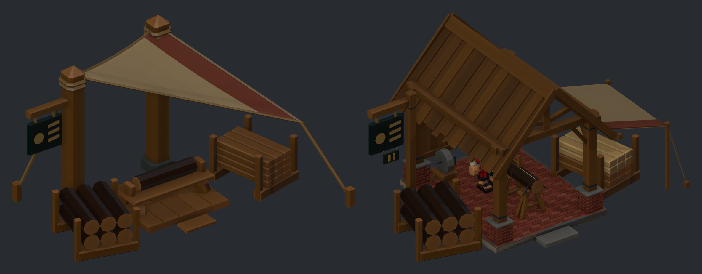
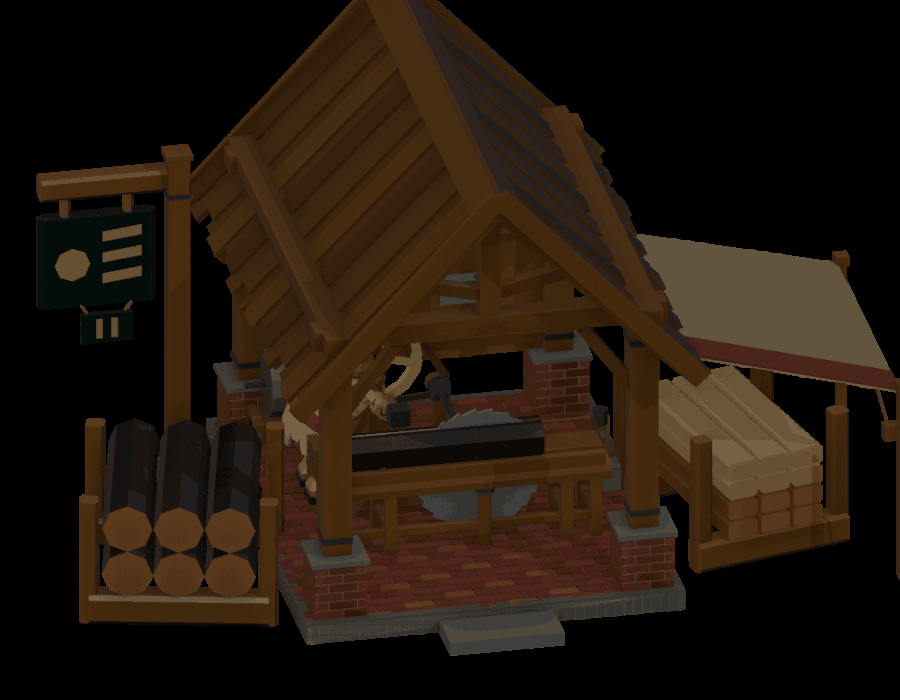
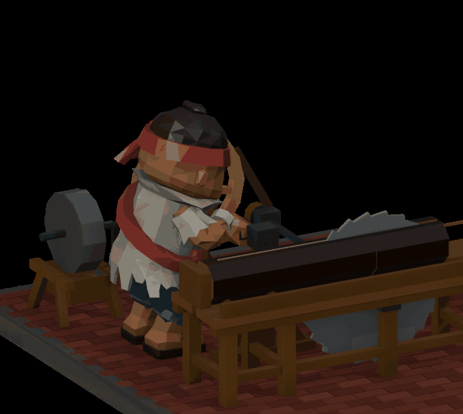

# Sawmill level 2 concept: the brick-footed saw shed

Concept for review, not a game kit. Built by `tools/blender/sawmill_l2_concept.py`
from the level 1 kit (`lumber-mill-state-kit.fbx`), in game metres.

## What level 2 is in the game

Raised at fire II (hamlet) for **6 brick + 4 fine boards**. It works **1.5× faster** and
opens **fine boards** (2 boards make 1 fine board on an iron saw blade, which wears at 0.05).
So the shed is level 1 rebuilt with what the hamlet makes: brick, sawn boards and iron.

| Level 1 (tarp camp) | Level 2 (saw shed) |
|---|---|
| Canvas on two posts | Board gable roof on four squared posts with iron straps |
| Wooden work platform | Brick plinth, the same 0.16 m height |
| Bench, bucksaw cutting across the log | **Saw wheel**: an iron circular blade standing up through a saw table, driven by a **crank wheel** that the worker turns |
| No upkeep | A grindstone and a spare blade on the back wall (the blade wears) |
| Sign on a canvas pillar | Same sign on its own brick-footed post, with a brass **II** plate |
| Output rack of boards | The same rack: boards in the lower courses, **fine boards** (paler, planed) in the upper ones |

The level 1 canvas stays on as a lean-to over the output rack, so the building still reads as the same place.

## Kept the same, so it swaps in place

- The plot (7.56 × 5.85 m), with the ridge at 3.83 m (limit 3.84). The script checks both.
- Every other `MillL1Import` marker: `Worker_Approach`, `Input_Pickup`, `Output_Dropoff`,
  `Entrance_Anchor`, `Bench_Anchor`.
- The input cradle with `Input_Log_01..06`, and the output rack with `Output_Plank_01..12`.
## The saw wheel and the crank (Kevin, 2026-10-01)

- The saw table runs left to right, along the building's flow. Logs come in from the input cradle and are
  fed into the wheel, and the sawn slabs come out toward the output rack. A rope from a push block behind
  the log runs over a sheave at the table's end to a hanging stone, so the log feeds itself while he cranks.
- The saw wheel is iron, 1.04 m across and 2 cm thick, with no guard. Its axle runs just under the table
  top, so it stands 0.25 m above the log and cuts its full depth. The axle runs back to a small pulley
  beside him.
- **The crank:** a bent iron axle runs across in front of him, between two bearing posts. The U between the
  bearings is the handle, with a wooden grip for both fists. The flywheel (0.8 m across) is on the same axle,
  on his left, so it sits behind him from the game camera. A leather belt runs from the flywheel to the saw's
  pulley, and one turn of the crank turns the saw **5 times**.
- **He faces along the table toward the blade**, side-on to the game camera, and winds the crank with both
  hands. The crank only works this way round: a handle pointing at him needed a 130° bend at his wrist.
  `Worker_Stand` moves to (-0.95, 0.62) (Blender coordinates; level 1: -0.04, 0.66). The marker has no
  facing, so the clip turns him the 90° itself.
- The crank's size and place come from the clip. A search over handle distance, height, throw, grip width,
  lean and elbow direction, scored by the anatomy check, picked: centre 0.58 m ahead of him and 0.81 m above
  the floor, a 9 cm throw, and fists 0.29 m either side of his midline (game metres). The building is built
  from those numbers (`CRANK` in the script).

## The animation

| What | Where |
|---|---|
| His clip `Crew_Crank` (1.2 s loop, one turn) | `crew-meshy-v15/anims/deckhand-v15-anims.fbx`, with the other clips |
| The wheels: `Mill2_CrankWheel` turns once and `Saw2_Wheel` 5 times, in step with his clip | `sawmill-l2-concept.fbx` (object animation, same 1.2 s, frame 0 = his frame 0) |

- `Mill2_CrankWheel` and `Saw2_Wheel` have their origins on their axles and turn about local Y:
  crank `-360° × t - 90°`, saw 5 × that (`crank_angle` in the script). The saw's top teeth run toward the log.
- **Anatomy:** `check_v15_clip.py -- Crank` is clean on every frame, including the crank itself against
  his body. Saw and Chop are still clean.
- In the game: play `Crew_Crank` and the wheels' take together, both looping, from the same start.

 

The open gable faces the front, so the game camera sees him working. From the side and the rear
the roof hides more of him than the level 1 canvas did. If that is a problem, the roof can fade
from the rear (as the level 1 README already suggests), or the eaves can go up.

## Five levels: where level 2 sits

Each level adds one power source and one material, on the same plot, with the input on the left,
the work in the middle and the output on the right. **Levels 3–5 are proposals only**: the game
defines fire levels I–II and building level 2 so far.

| Level | Concept | New material or power | Work |
|---|---|---|---|
| 1 | Tarp saw camp (approved, in game) | timber, canvas | bucksaw on the bench |
| **2** | **Brick-footed saw shed (this one)** | **brick, an iron saw wheel** | **turn the crank wheel** |
| 3 | Treadwheel saw house: a walk-in treadwheel replaces the hand crank and drives a bigger saw wheel and a log carriage, with half-walls of brick | gearing, carriage | walk the treadwheel |
| 4 | Wind saw mill: a small post-mill head with sails on a brick tower drives two saw wheels | wind | feed the carriage, stack boards |
| 5 | Steam saw mill: a brick engine house with a chimney, an iron roof and a big saw wheel on a powered log carriage | steam, iron | feed the carriage, tend the boiler |

The way the levels progress (canvas, then board roof, then brick walls, then the tower, then the chimney)
gives each level a silhouette you can tell apart at island zoom.

## Files

| File | What |
|---|---|
| `sawmill-l2-concept.fbx` | The concept, with the reused level 1 slots and markers under `LumberMill_C_Level_2`, and the wheels' animation |
| `l1-vs-l2.png` | Level 1 (bench lowered) and level 2 from the same camera, at the same scale |
| `l2-hero.png`, `l2-front.png`, `l2-right.png`, `l2-rear.png`, `l2-top.png` | Review angles |
| `l2-crank.gif`, `l2-crank-closeup.gif` | The work loop: him cranking, the wheels turning (the close-up leaves out the shed and the log rack) |
| `l2-hero-crew.png`, `l2-work-closeup.png` | Him at the crank (frame 9), for scale (the close-up has the roof hidden) |
| `l2-mechanism.png`, `l2-work-rear.png` | The saw table, saw wheel, crank wheel and him, with the shed hidden |
| `l2-roof-off.png` | Roof hidden: the frame, the floor and the layout |

About 12.6k triangles in all, most of them proud bricks. A game kit would bake the bricks into a texture.

Not done yet: a state kit (loaded, cutting and finished variants for the saw table), the importer, and the
log sliding into the blade (the game would move `Bench2_Cutting` along X while he works).
