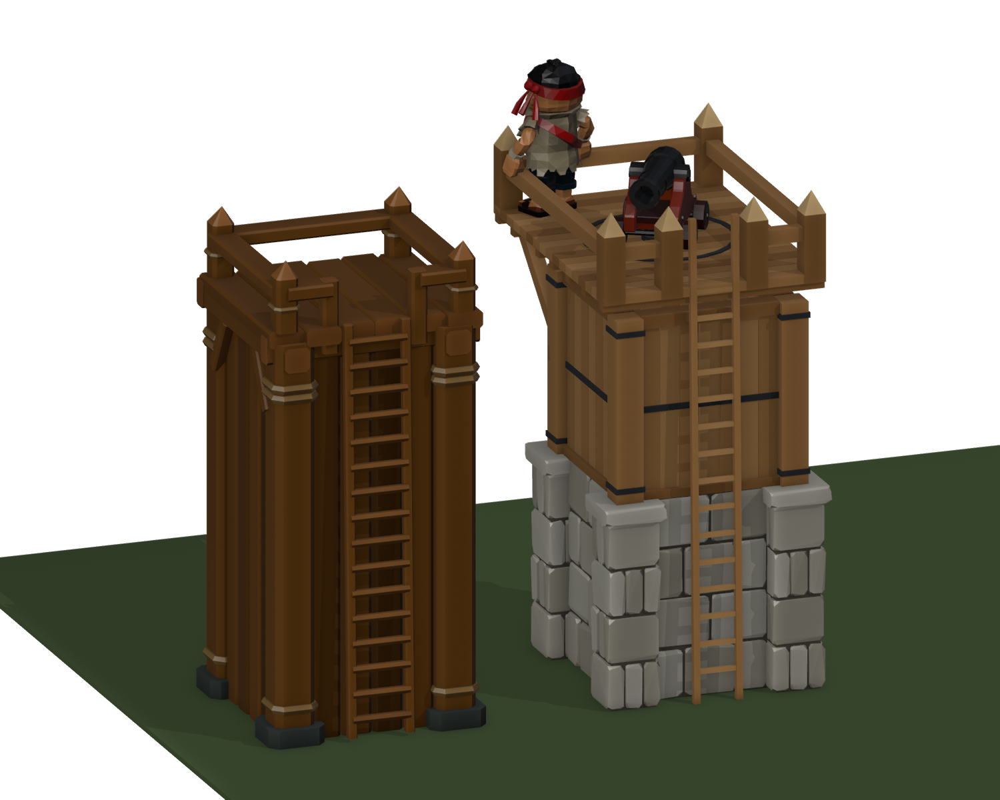

# Watchtower level 2 concept: level 1's tower, half stone, with a gun bay

Concept for review, not a game kit. Built by `tools/blender/tower_l2_concept.py`.
Kevin, 2026-10-01: *"essentially the same tower, half stone like the wall, and the side opposite the ladder
to have a small extended section to make more room for the canon."* (This replaces a first version with a
wide deck on open legs.)

## The design

- **Level 1's tower** (`Art/TowerL1`, chunky V5): a closed box on the 2.6 × 2.6 m plot with corner posts,
  walls, the ladder up the front (−Y), a deck at 4.61 m, and an open rail with pointed posts.
- **Lower half stone (to 2.25 m), like the level 2 wall:** crude stone corner pillars and stone walls
  between them.
- **Upper half oak:** corner posts with iron bands, plank walls on a sill, a top beam, an iron band round
  the middle.
- **Gun bay:** the deck runs **1.2 m past the back wall**, opposite the ladder, on three outrigger beams and
  knee braces. The deck is now 2.5 × 3.5 m, against level 1's 2.4 × 2.4.
- **Rail:** level 1's open rail, simplified for readability (Kevin: *"fewer components ... bigger"*): six
  chunky pointed posts (0.24 m, at the four corners and either side of the ladder) and **one heavy rail**
  (0.14 × 0.16 m) at 0.44 m, with its top at 0.52 m, under the gun barrel.
- **Gun:** an iron traverse ring round a new **`Gun_Pivot` marker at (0, 0.6, 4.61)**, the middle of the
  bigger deck.

## Room for the cannon (checked by the script against Astra's cannon at `Gun_Pivot`)

- **The cannon is shown at 0.75 scale** (Kevin: *"reduce the canon in size some so it fits better"*). At that
  size its wheels and carriage sweep **0.69 m** and the whole gun 0.98 m. It turns a full circle inside the
  rail, which is 1.11 m to each side and 1.57 m fore and aft.
- **Room behind the breech for a gunner:** 0.91 m when firing toward the ladder or the bay, 0.45 m when
  firing to the sides.
- **For the game:** size `WatchtowerGun`'s gun to match, about three quarters of Astra's cannon (its own
  primitive gun is at scale 1.1 today), or re-run the check at the real size.
- The ladder comes up at the deck's front edge, far outside the gun's circle.

## Contract

| | Level 1 | Level 2 |
|---|---|---|
| Plot below the deck | 2.6 × 2.6 | same; the script fails the build if anything below 3 m leaves it |
| Deck height (`WatchtowerGun.DeckHeight`) | 4.61 m | **same** |
| `Ladder_Bottom` / `Ladder_Top` / `Lookout_Anchor` | (0,−1.23,0.05) / (0,−1.10,4.61) / (0,0,4.61) | **same** |
| `Gun_Pivot` | none | **(0, 0.6, 4.61)**, new |
| Overall height (`BuildPlan` `ridge`) | 5.37 m | 5.51 m (rail post points) |
| Above the plot | none | the bay overhangs to y +2.32 m at the deck |

**For the game:** `WatchtowerGun` puts its gun at the tower's origin, which is (0, 0) on the deck. At level 2
it should use `Gun_Pivot` instead. At (0, 0) the gun sits too far forward of the bay's middle (0.6 m), so the
bay doesn't add the room it was made for. When the tower snaps onto a wall, the bay faces away from the
ladder, which is out of camp (the ladder side is the camp side).

Root `Watchtower_Level_2`; meshes `TowerL2_Pillars`, `_Stone`, `_Timber`, `_Deck`, `_Rail`, `_Ladder`.
6,540 triangles, most of them the crude stones.

## Files

| File | What |
|---|---|
| `watchtower-lvl2.fbx` | The tower and its four markers (no cannon: the game builds its own) |
| `tower-l2-hero.png`, `tower-l2-front.png`, `tower-l2-side.png`, `tower-l2-rear.png` | With Astra's cannon and the deckhand for scale |
| `tower-l2-deck.png`, `tower-l2-top.png` | The deck; from above with the gun's reach drawn: red = wheels, gold = muzzle |
| `tower-l2-traverse.gif` | The cannon (0.75 scale) turning a full circle at `Gun_Pivot` |
| `tower-l1-vs-l2.png` | The level 1 tower (left, its texture colours approximated) and level 2, same camera |

Not done yet: a game importer (`TowerL2Import`, like `TowerL1Import`), colliders, rail limits in the
walking logic, and checking that `WatchtowerGun`'s own primitive gun (scale 1.1) fits the same circle.
