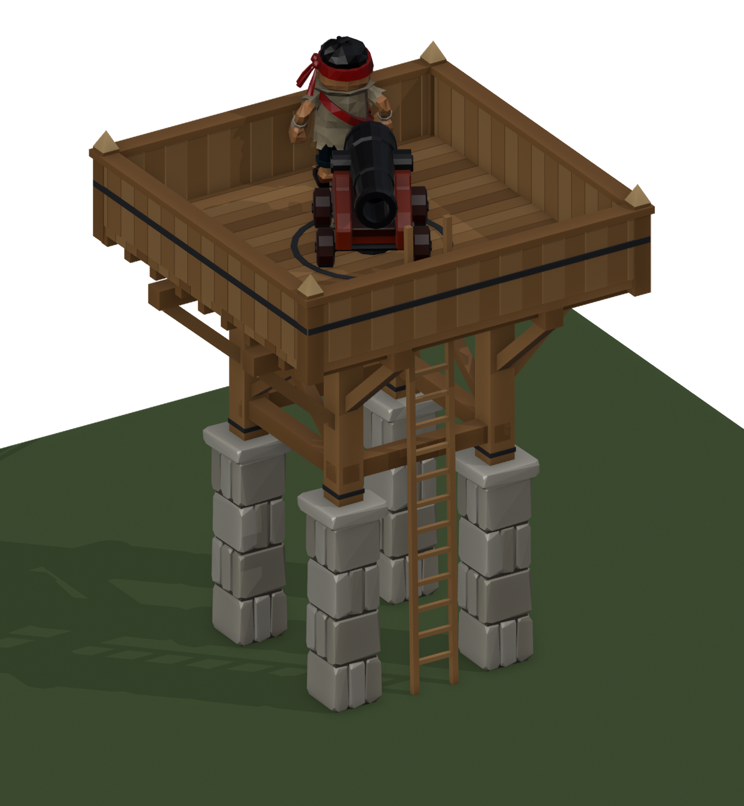

# Watchtower level 2 concept: a wide gun deck on stone legs

Concept for review, not a game kit. Built by `tools/blender/tower_l2_concept.py`.
Kevin, 2026-10-01: *"it should have a wider area to stand on to allow for more canon movement."*

## Why the deck had to grow

Astra's cannon (`art-staging/cannon-astra-v1`) turns about its root. Its wheels and carriage sweep a
**0.92 m** radius and its muzzle **1.31 m**. The level 1 tower's deck is about 2.4 m across, too small for
the gun to turn with a gunner behind it.

## The design

- **On the ground, the same plot** (buildings keep their plot across upgrades): four crude stone legs, the
  level 2 wall's pillars at 2.6 m, inside the 2.6 × 2.6 m plot. The script fails the build if anything below
  2.4 m leaves the plot.
- **Above them:** squared oak posts with iron bands, tie beams, X-braces on three sides (the ladder side
  stays open), and girders with knee braces that carry the deck out over the plot.
- **Deck: 4.2 × 4.2 m**, about three times level 1's area, with a low oak parapet (0.72 m, cap rail, iron
  band, pointed corner posts). The gun fires over the parapet: its bore is at about 1 m.
- **Gun:** an iron traverse ring and pivot block at the deck's centre (`Lookout_Anchor`), where
  `WatchtowerGun` already puts its gun.
- **Checked by the script:** the gun's low footprint (0.92 m) turns a full circle inside the parapet
  (1.96 m), leaving **0.89 m** behind the breech for a gunner. The ladder hatch's inner edge is 1.00 m from
  the pivot, outside the wheels' sweep.

## Same contract as level 1 (`TowerL1Import`, `WatchtowerGun`)

| Marker / value | Level 1 | Level 2 |
|---|---|---|
| Deck height (`WatchtowerGun.DeckHeight`) | 4.61 m | **4.61 m**, unchanged |
| `Ladder_Bottom` | (0, −1.23, 0.05) | same |
| `Ladder_Top` | (0, −1.10, 4.61) | same: the ladder comes up through a hatch, its lid propped open |
| `Lookout_Anchor` | (0, 0, 4.61) | same: the gun's pivot |
| Ground plot | 2.6 × 2.6 | same |
| Overall height (`BuildPlan` `ridge`) | 5.37 m | **5.65 m** (parapet corner points). Update `ridge` if level 2 uses it |
| Deck overhang | none | the deck reaches ±2.1 m, past the plot at height. Selection, occlusion and the wall-tower snapping should use the deck's size, not the plot's, where it matters |

Root `Watchtower_Level_2`; meshes `TowerL2_Legs`, `_Frame`, `_Deck`, `_Parapet`, `_Ladder`. Blender
coordinates, Z up, front/ladder −Y. 5,392 triangles, more than half of them the legs' stones.

## Files

| File | What |
|---|---|
| `watchtower-lvl2.fbx` | The tower and its three markers (no cannon: the game builds its own gun) |
| `tower-l2-hero.png`, `tower-l2-front.png`, `tower-l2-rear.png` | With Astra's cannon and the deckhand, for scale |
| `tower-l2-deck.png`, `tower-l2-top.png` | The deck; from above with the gun's reach drawn: red = wheels, gold = muzzle |
| `tower-l2-traverse.gif` | The cannon turning a full circle on the deck |
| `tower-l1-vs-l2.png` | The level 1 tower (left, colours approximated) and level 2, same camera |

Not done yet: a game importer (`TowerL2Import`, like `TowerL1Import`), colliders, the hatch in the walking
or occupancy logic, and checking that `WatchtowerGun`'s own primitive gun (at scale 1.1) fits the same
circles as Astra's cannon.
