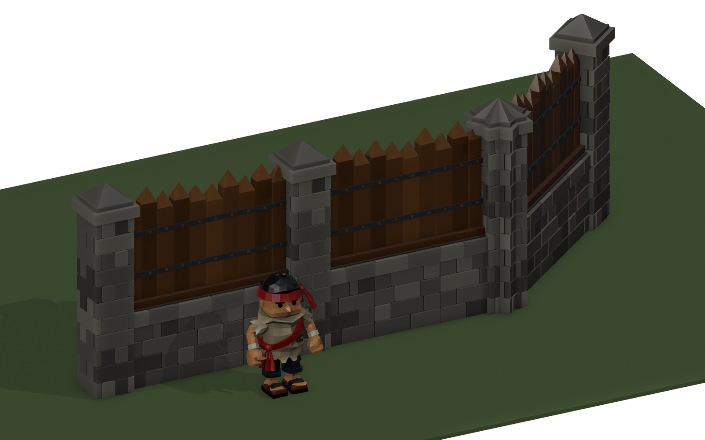

# Wall level 2 concept: stone base, squared timbers, stone pillars

Concept for review, not a game kit. Built by `tools/blender/wall_l2_concept.py`.
Kevin, 2026-10-01: *"half wood (sturdier wood) and half stone blocks towards the base and for the pillars"*.

## The design

- **Base:** stone blocks, 1.15 m high (chest height on the 1.7 m deckhand) and 0.40 m thick, in four courses
  under a wider capstone course. The base is mortared rather than dry-laid: the stones stand slightly proud
  of the mortar, with varied tones.
- **Upper half:** squared timbers, 0.23 × 0.17 m, about three times the bulk of the level 1 stakes. They are
  hewn to points, stand on an oak sill, and have two riveted iron bands across the front and two rails with
  pegs at the rear. The tops are at 2.45–2.65 m, varied per run so a long wall doesn't look stamped out.
- **Pillar:** stone all the way up, 0.56 m square, with alternating block courses at the corners, a wider
  capstone and a pointed stone cap, 3.05 m high.

## Same contract as the level 1 palisade

Built to the rules of `art-staging/palisade-astra-lvl1-v2`, so the wall code that places level 1 can place
it too:

- Metres, Blender +X along the wall, +Y the rear, +Z up.
- Each run's origin is at its start end, on the ground, with `<Part>__Snap_Start` (0,0,0) and `__Snap_End` (1,0,0).
- Timbers sit on the same 0.25 m spacing (centres at 0.125 + i·0.25).
- **The modules tile seamlessly:** courses alternate between joints at the module ends and joints a quarter
  metre in, so the quarter-metre end blocks of two runs make one stone. Variants A, B and C differ in joints
  and timber heights, and any order works.
- **Pillars:** each pillar's origin is at its start edge, and `Wall2_Post__Post_Center` (0.28,0,0) goes on the
  bend or end point. The pillar is wider than the run (0.56 m against 0.40 m), so it hides run ends at
  moderate bends.

| Piece | Triangles |
|---|---|
| `Wall2_Run_1m_A` / `B` / `C` | 492 each |
| `Wall2_Post` | 834 |

## Files

| File | What |
|---|---|
| `wall-l2-kit.fbx` | The three runs and the pillar, with their snap and centre markers |
| `wall-l2-hero.png`, `wall-l2-rear.png`, `wall-l2-front.png`, `wall-l2-closeup.png` | A 9 m stretch with a 40° bend, and the deckhand for scale |
| `wall-l1-vs-l2.png` | The level 1 palisade (left) and level 2 on one line, same camera |
| `wall-l2-kit.png` | The modules on their own |

Not done yet: fillers (0.5 and 0.25 m), the breached run, a level 2 gate, trimming at arbitrary
lengths and angles (the same adapter work as level 1), and a game importer.
