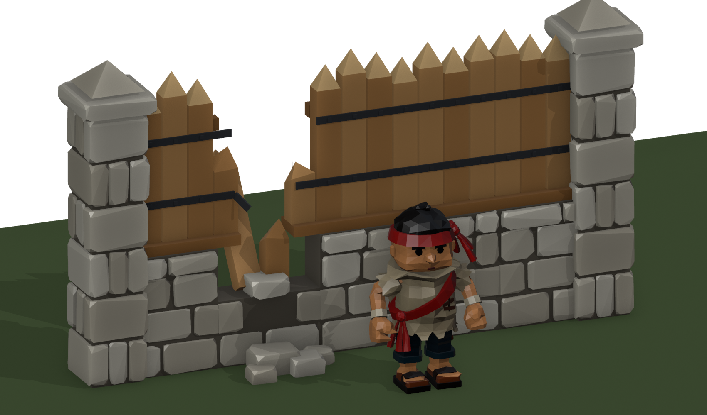
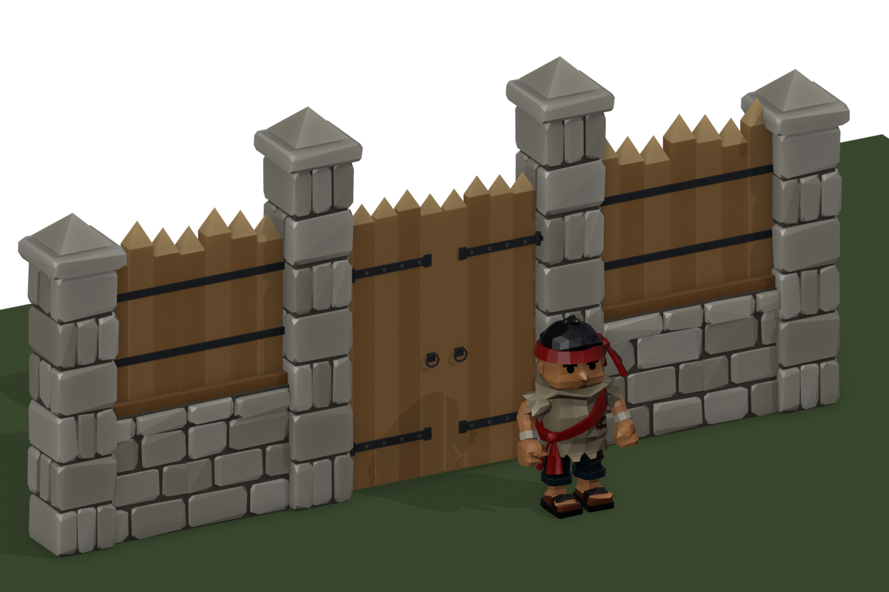

# Wall level 2 concept: stone base, squared timbers, stone pillars

Concept for review, not a game kit. Built by `tools/blender/wall_l2_concept.py`.
Kevin, 2026-10-01: *"half wood (sturdier wood) and half stone blocks towards the base and for the pillars"*.

## The design

- **Base:** big stone blocks, 1.15 m high (chest height on the 1.7 m deckhand) and 0.40 m thick: three courses
  of roughly half-metre stones under a wider capstone course, in three pale tones over darker mortar. Each
  stone is **crude and hand-dressed**: every corner knocked off by its own uneven chamfer (2.5–7 cm), the faces
  a little out of true, and the stone standing up to 1.2 cm proud or shy of its neighbours. The wide joints
  (4.5 cm) still carry the read at game zoom. The shapes are seeded by position, so every build is identical.
- **Upper half:** squared timbers in light oak, 0.23 × 0.17 m, about three times the bulk of the level 1 stakes.
  They are hewn to points, stand on an oak sill, and have two riveted iron bands across the front (kept dark
  for contrast) and two rails with pegs at the rear. The tops are at 2.45–2.65 m, varied per run.
- **Pillar:** the same pale stone all the way up, 0.56 m square, in six chunky courses whose corner stones
  alternate which face runs long, with a wider capstone and a pointed stone cap, 3.05 m high. Its stones are
  dressed the same crude way.

Revised 2026-10-01 (Kevin: *"fewer and chunkier ... keep in mind the readability ... lighter stones and
lighter wood"*): five courses became three, the pillars went from eleven courses to six, and the stone and
oak both moved several steps lighter. Then (*"too uniform ... more crude, natural bevels"*) the stones were
given their uneven chamfers. Where two runs' end stones meet as one, that seam side stays square.

## Same contract as the level 1 palisade

Built to the rules of `art-staging/palisade-astra-lvl1-v2`, so the wall code that places level 1 can place
it too:

- Metres, Blender +X along the wall, +Y the rear, +Z up.
- Each run's origin is at its start end, on the ground, with `<Part>__Snap_Start` (0,0,0) and `__Snap_End` (1,0,0).
- Timbers sit on the same 0.25 m spacing (centres at 0.125 + i·0.25).
- **The modules tile seamlessly:** the middle course has quarter-metre end stones that run flush to the
  module ends, so two runs' end stones meet as one half-metre stone. The other courses joint at the module ends. Variants A, B and C differ in joints
  and timber heights, and any order works.
- **Pillars:** each pillar's origin is at its start edge, and `Wall2_Post__Post_Center` (0.28,0,0) goes on the
  bend or end point. The pillar is wider than the run (0.56 m against 0.40 m), so it hides run ends at
  moderate bends.

| Piece | Triangles |
|---|---|
| `Wall2_Run_1m_A` / `B` / `C` | 714 each |
| `Wall2_Filler_050m` | 402 |
| `Wall2_Filler_025m` | 296 |
| `Wall2_Breached_1m` | 610 |
| `Wall2_Post` | 1,118 |

### Fillers and the breached run

- **Fillers, `Wall2_Filler_050m` and `Wall2_Filler_025m`:** built by the same code as the 1 m runs, with two
  timbers and one timber, start-end roots and `__Snap_Start` / `__Snap_End`. The 0.5 m filler's middle course
  has two flush quarter-metre end stones, so it pairs with its neighbours like a full run. The 0.25 m filler's
  stones run flush end to end. Any mix of runs and fillers tiles with no seam, as the 4.75 m stretch above
  shows (runs 1, 1, 1, then fillers 0.5 and 0.25, then a run).
- **Breached, `Wall2_Breached_1m`:** the same 1 m span and snaps as a run, smashed in the middle.
  - **Ends still meet:** the footing course is whole and the middle course keeps its end stones, so both
    ends meet whole runs cleanly.
  - **Stone:** the stones above are knocked out, apart from stubs at the ends. They lie on the ground in
    front and behind, with one capstone slumped into the gap.
  - **Timbers:** the outer two are snapped high with jagged, splintered tops. Of the inner two, one is snapped
    low and one is knocked over forward.
  - **Bands and rails:** the iron bands and rear rails are torn off at the gap, with one band end bent out.
  - **Use:** like level 1's breached piece, it goes over the damaged middle third of a segment. Decoration
    only: no colliders.

**At a bend:** one pillar per node, never two, turned halfway between the two legs that meet there. The
first version put a pillar at the end of one leg and another at the start of the next, crossed at 40°.
The renders' `wall_line` now walks the whole polyline once. The game's wall adapter needs the same rule.

## The gate

Built by `tools/blender/gate_l2_concept.py`. It uses the level 2 wall's stone and oak, built to the
level 1 gate's contract (`Gate_L1`):

- **A 3 m module**, origin at its start end on the ground. `Gate2__Snap_Start` (0,0,0), `__Snap_End` (3,0,0),
  `__Passage` (1.5,0,0).
- **The gate brings its own two pillars:** the wall's crude stone pillars, taller (3.6 m, seven courses),
  with centres at 0.28 and 2.72 (`__Post_Center_Left` / `_Right`). The wall code must not place its own
  pillar on the gate's two nodes.
- **No lintel:** the opening is open to the sky between the two pillars (Kevin: *"remove the top beam"*).
  The hinge pins are their own small piece, `Gate2_Pintles`.
- **Leaves:** four pointed oak planks each. On the front, two long iron strap hinges with studs and a ring pull
  at the meeting edge. On the back, three ledges and a Z-brace, with the braces climbing from the hinge side
  as they should.
- **Hinges:** `Gate2_Leaf_Left` sits under `Gate2_Hinge` and `Gate2_Leaf_Right` under `Gate2_Hinge_Right`.
  Closed is 0°, open is −100° (left) / +100° (right) about local Z, both swinging out to −Y, as level 1.
- **Swing check:** the script sweeps both leaves through 0–100° in 5° steps against the pillars' actual
  stones. The closest any part comes is **2.6 cm** (the hinge knuckles on their pintles excluded); the
  build fails if anything touches. The first layout cut 4 cm into the stone at full open, so the hinges
  now sit 4 cm off the pillar face, near its front.
- **Breached** (`Gate2_Breached`): the pillars stand, the leaves are gone, there is rubble on
  the ground, and two splintered planks remain on the left hinge.

**Clear opening: 1.88 m**, narrower than level 1's 2.22 m, because the stone pillars are wider and stay
inside the 3 m module. That's fine for a 1.7 m crew member on foot. If carts or several hands at once
need more width, the gate module would have to grow past 3 m.

| Piece | Triangles |
|---|---|
| Intact gate (pillars, pintles, two leaves) | 3,484 |
| Breached gate | 2,844 |

| File | What |
|---|---|
| `gate-l2-kit.fbx` | `Gate2` (intact, closed) and `Gate2_Breached`, with markers and hinge empties |
| `gate-l2-closed.png`, `gate-l2-open.png`, `gate-l2-breached.png` | In the wall, the deckhand for scale |
| `gate-l2-front.png`, `gate-l2-rear.png`, `gate-l2-closeup.png` | Front hardware, rear ledges and braces |
| `gate-l2-open-top.png` | Open, from above |
| `gate-l1-vs-l2.png` | The level 1 gate (left) and level 2, same camera |

## Files

| File | What |
|---|---|
| `wall-l2-kit.fbx` | The three runs, both fillers, the breached run and the pillar, with their snap and centre markers |
| `wall-l2-pieces.png`, `wall-l2-breach.png`, `wall-l2-breach-rear.png` | Runs, fillers and the breach in one stretch; the breach close up |
| `wall-l2-hero.png`, `wall-l2-rear.png`, `wall-l2-front.png`, `wall-l2-closeup.png` | A 9 m stretch with a 40° bend, and the deckhand for scale |
| `wall-l2-bend.png`, `wall-l2-bend-rear.png`, `wall-l2-bend-top.png` | The 40° bend close up: one pillar, turned to the bisector |
| `wall-l1-vs-l2.png` | The level 1 palisade (left) and level 2 on one line, same camera |
| `wall-l2-kit.png` | The modules on their own |

Not done yet: trimming at arbitrary
lengths and angles (the same adapter work as level 1), and a game importer.
